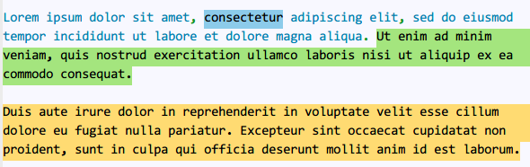
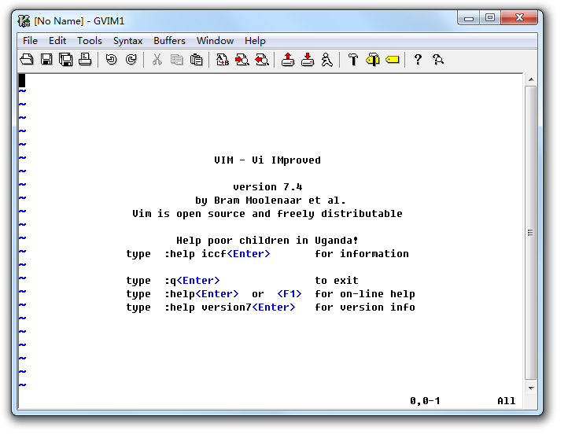
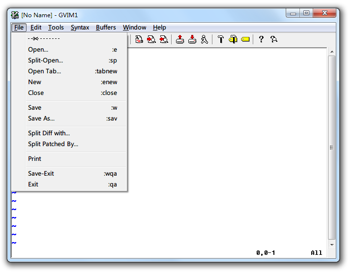
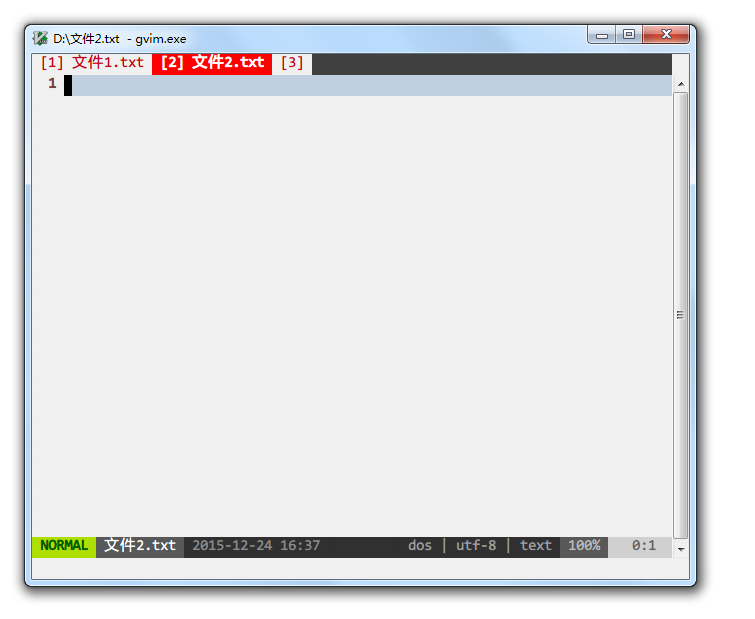
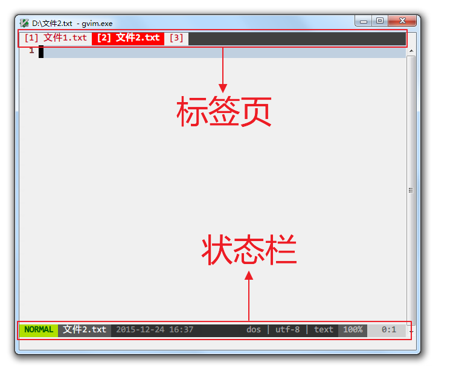
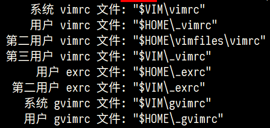

# 写给非程序员的 Vim 新手教程

想为非程序员写一篇 Vim 新手入门教程有很久了。
很多人说 Vim 入门学习曲线陡峭，又只适合程序员、系统管理员使用，纷纷敬而远之。
网络上各种入门教程要么千篇一律，要么极为简单。
对新人确实不够友好，一定程度上也阻止了更多的人学习、喜爱上 Vim。

而以我自学的经历来说，Vim 的上手远没想象的那么恐怖。
非程序员写写中文文章、脚本、配置文件等也能从 Vim 中获益良多。
也许我自学的方法和心得对新人有用，希望这篇新手教程能够帮到愿意尝试 Vim 的朋友。

既然是面向非程序员，教程基于 Windows 下的 gVim（GUI 图形界面版本），这样可以覆盖尽可能多的新手，降低入门难度。
我自己使用 gVim 8.x 版本，示例截图统一采用 Github 配色方案。

## 为什么选择 Vim

我曾经在 Windows 平台下寻找了很久，希望找到一个功能强大、稳定、高效、占用资源少、自定义能力强，最好是免费、开源、跨平台（只是日常使用也会接触到各种操作系统）的编辑器。
其他要求容易评价，功能强大、高效和自定义需求方面，很难说哪个编辑器是适合所有人的。
就我自己而言，反正在主力编辑器换用 Vim 之前，经常会为了增加或完善某个功能尝试不同的编辑器。
而在那之后，基本上只需要找相应的操作快捷键、命令、配置或插件，因为99%的情况下，Vim 已经做到了，只等着你去发掘。

因此，只要度过最初的入门阶段，知道到哪里去发现增强功能的手段，今后的文本编辑和处理就可以一直在 Vim 的平台上完成，越来越熟练，从而节省了寻找和适应新编辑器的时间。

而且，Vim 的设计哲学与其他文本编辑器截然不同，在这种设计哲学下，文本操作效率高，入门后复杂的快捷键和命令其实也并不难记忆，习惯了之后有举重若轻、事半功倍的快感。
即使许多编辑器有模仿 Vim 操作指令的模式，但只能模仿一部分，永远也无法完全复制原生 Vim 的体验。

## Vim 的入门之道

传说中 Vim 的学习曲线是陡峭的悬崖，但我更倾向于认为这是因为入门方法不正确。
我希望新人们先接受 Vim 的设计哲学，了解到 Vim 的操作为什么如此与众不同，明白如此设计的优势何在，看上去纷繁无比的命令、指令和配置才不会显得那么可怕，反而可以在不断的学习中融会贯通。

从心态上说，我希望初学者从基本的编辑功能开始，逐步替换基本的编辑器，不要试图一下子掌握太多技能。
然后也不用纠结一上来就完全抛弃鼠标和方向键，练习的过程中觉得怎么方便怎么来就行，不要给自己太多压力。

### 其他教程

为避免本教程水平有限误人子弟，欢迎不得其法的入门者尝试以下的其他教程，不要因为入门艰难而放弃探索这个有意思的编辑器。
也可相互参考，同步学习，不必拘泥于本教程的章节顺序设置。

- 自带教程 Vim Tutor
Vim 自带了详细的教程，进入方式就是打开 Vim 之后输入 `:help tutor`。
如果你安装的 Vim 没有自带中文教程，可以下载[中文教程](http://sourceforge.net/projects/vimcdoc/)并安装，再输入以上的命令。
自带教程其实已经非常完善，按顺序阅读下来就能入门。但不足之处是有时候比较啰嗦，有时候又一笔带过，而且并未详述 Vim 的设计理念。

- [大家來學VIM（一個歷久彌新的編輯器）](http://www.study-area.org/tips/vim/)
我开始入门时就有的经典教程。

- [Learn Vim Progressively](http://yannesposito.com/Scratch/en/blog/Learn-Vim-Progressively/)
中文翻译：[简明 Vim 练级攻略](http://coolshell.cn/articles/5426.html)

- [普通人的编辑利器——Vim](http://blog.sina.com.cn/s/blog_46dac66f010005kw.html)

- [善用佳软整理的教程与学习资料汇总](http://xbeta.info/vim-tutorials.htm)

- [Vim Introduction and Tutorial](https://blog.interlinked.org/tutorials/vim_tutorial.html)

- [Vim 学习笔记](http://yyq123.blogspot.com/search/label/Vim)

### 其他编辑器推荐

Vim 肯定不可能适合所有人，只要你找到最适合自己的工具，完成好自己的工作，不用纠结这个工具在别人看来如何。
如果最终还是没法适应 Vim，我推荐在 Windows 下其他几款文本编辑器：

- [Visual Studio Code](https://code.visualstudio.com/)
微软出品的跨平台编辑器，功能强大，界面美观，插件丰富，社区活跃。
如果你不打算学习 Vim 或 Emacs 这类入门学习曲线很高的编辑器，那么我强烈推荐 VS Code。

- [Notepad ++](https://notepad-plus-plus.org/)
基于 [Scintilla](http://www.scintilla.org/) 的开源、免费文本编辑器，遵循 GPL 协议。

- [EverEdit](http://cn.everedit.net/)
国人开发的共享软件，支持多种新颖的功能，如文档地图、颜文字等，还有专为中文用户开发的功能，如纵向书写模式、中文括号自动匹配等。
有30天试用期，详情可参考善用佳软的[介绍文章](http://xbeta.info/everedit.htm)。

- [EmEditor](https://www.emeditor.com/)
日本公司开发的共享软件，速度快，大文件支持好，有多种贴心功能。
有可免费使用的老版本。

- [Sublime Text 2](http://www.sublimetext.com/2) 和 [3](http://www.sublimetext.com/3)
很受程序员欢迎的文本编辑器，界面美观，功能强大。

- [UltraEdit](http://www.ultraedit.cn/)
很经典的编辑器，至今还有大量程序员在使用。

- [EditPlus](https://www.editplus.com/)
另一款非常经典的编辑器，韩国人出品，同样也有大量用户。

## Vi 的设计哲学和操作逻辑

学习 Vim 最关键的不是死记硬背，而是先知其所以然。

Pascal Precht 在《[为何使用 Vim](https://pascalprecht.github.io/2014/03/18/why-i-use-vim/)》中说，用好 Vim 要理解：

- 模式概念
- 文本对象

Vim 特有的操作逻辑都基于这两个概念。
然后你会发现，[Vim 的学习曲线](https://pascalprecht.github.io/2014/03/18/why-i-use-vim/#figure-1)更像翻墙而过，而不是一直爬陡坡。

以下的概念介绍很重要，但不必记住具体的操作，后面的基础操作讲解中都会提到，到那个时候再动手练习也不迟。

### 模式

Vim 的模式有许多种，作为入门者最常接触的也有四种（近似的模式做了合并）：

1. 普通模式 normal mode
用于输入编辑文本的指令，和移动光标。
例如在普通模式下输入 `x`，会立即删除光标所在的字符（你可以将 `x` 理解为画一把叉表示删除，方便记忆）。
输入 `h`/`j`/`k`/`l` 分别是向左/下/上/右横向一个字符或纵向移动一行。

2. 插入模式 insert mode
用于输入文本字符。与一般的文本编辑器并无二致。

3. 命令模式 command/ex mode
用于输入命令，执行函数，变更配置。
例如在普通模式下，输入 `:` 进入命令模式，然后输入 `sort` 回车，给所有行排序。

4. 可视/选择模式 visual/select mode
用于选择文本对象，以便对其执行下一步操作。
例如在普通模式下，输入 `V` 会选中光标所在的那一整行，接下来输入的操作命令都是针对这一整行文字的。

新手学习 Vim 遇到的第一堵墙一般是，一开始进入 Vim 并不能直接输入文字，因为默认是处于普通模式中。

那为什么 Vim 要设计多模式呢？
我的理解是，文本编辑器在**输入文字**之外，还有**调整文字**的任务，因此必然需要输入一套命令信息，并能区分于输入的文字信息。

输入的命令信息可以分为三类：

1. 非键盘操作
比如鼠标或手指的选择、点击、拖拽等等，或借助菜单触发指令。
一般的文本编辑器都支持这种方式，直观易上手是最大的优点。
弊端是，随着操作越来越多，此类命令就越难以记忆，或者界面上的菜单、按钮等等越来越复杂。
在 Vi/Vim 诞生的年代，还没有普及这么高级的输入方式，虽然现在也支持，但许多人入门后会隐藏菜单、禁用鼠标。

2. 增加指令键，引入按键组合
`Ctrl`、`Shift`、`Alt`/`Meta`/`Options`、`Windows`/`Command`，`Fn`、`F1`-`F12`等功能键，`Insert`、`Delete` 等编辑键，这些按键和字母、数字、符号键的组合，以及这些组合之间的组合，都能与输入的文字信息区分开来，让计算机可以识别。
一般的文本编辑器也采用这种方法，与第一种方案结合，可以满足大部分人的需求。
Vim 中的许多指令也会用到这些按键组合。
弊端是，有的辅助按键本身并无含义，又住在键盘的偏远角落里，有的复杂命令可能需要多个按键同时按下，还可能反复多次组合，长期使用下来，手指很遭罪，记忆难度也迅速上升。

3. 增加模式
增加模式的结果是，在插入模式下用于输入文字的按键，在普通模式下按下就变成修改文本或移动跳转的命令，在选择模式下就变成改变选择范围的命令。
相当于**在输入按键基本不变的前提下，输入的命令信息因为模式的增加而翻倍**。
这样，数字、字母、符号键也就能够充分利用起来，这些按键的意义也比辅助按键易于记忆。
正是这种不同一般的思路使 Vi/Vim 选择多模式方案，与一般的文本编辑器分道扬镳。

### 文本对象
Vim 可以识别文本中的英文单词、句子、段落、块，并有对应的文本对象选择命令。
与编辑、移动、选择的命令结合起来，可以快速的操作整个文本对象。

以如下这段文字为例：

普通模式下，光标在浅蓝色范围内任意一处时，按下 `viw` 就会选中整个浅蓝色部分的单词。
而这个命令组合翻译过来就是：
v: visual，进入可视模式，开始选择文本
i: inside/inner，内部，表示如果单词后面有空格等其他字符，选择的范围不包括空格
w: word，单词

**学习和记忆 Vim 的指令时，建议尽量找到其对应的英文单词**，只要能方便记忆就行，不必纠结于单词是否正确。
这样很多指令组合就像用英语说话，可以大大降低记忆难度。

如果光标在绿色范围内时，按下 `yis` 就会复制整个绿色部分的句子。
这组命令的含义是：
y: yank，复制
i: inside/inner，内部
s: sentence，句子
非常接近于自然语言：yank inside sentence.

如果光标在黄色范围内时，按下 `dap` 就会清除整个黄色部分段落的内容，光标停留在下一段的起始处。
这组命令的含义是：
d: delete，删除
a: around，围绕在外部
p: paragraph，段落
delete around paragraph.

注意，Vim 并不能按照中文文本对象规则识别中文字符和标点，比如在处理如下示例文字时：

粉红色部分会识别为一个单词，理想情况下应该按中文含义分词再选择，显然目前还没有编辑器能够做到这点。
淡紫色部分会识别为整个句子，这就错得更加离谱了，原因是 Vim 对逗号、分号、句号一视同仁。
淡蓝色部分还是会识别为段落，因为段落是根据换行判断的，中英文没有区别。

### 做好一件事
Vim 只专注做一件事情——纯文本编辑器，不考虑富文本编辑，不插入图片，更没有成为“操作系统”的野心。

## 安装

### 下载
到 [Vim 官方网站下载页](http://www.vim.org/download.php)下载，Windows 平台用户选择安装包文件即可。

安装的过程就不做演示了，但请务必记住 Vim 的安装目录，其下有名为 vimrc 的文件，是 Vim 的关键配置文件，后面会详细说明。

如果今后报错说缺少 iconv.dll 文件，可以从 [gettext for Win32](http://sourceforge.net/projects/gettext/) 下载的文件中提取，放在 gvim.exe 所在的目录中，如 `vim74` 目录。

有其他人自己编译了支持 Perl、Ruby、Lua 等的 Vim 版本，这样可以用上更加强大的插件。
你可以下载 Vim 源码自己编译，也可以下载其他人编译的版本，比如[这里](https://tuxproject.de/projects/vim/)和[这里](http://www.kaoriya.net/software/vim/)。

### 启动参数

Windows 下使用 Vim 打开文本文件会自动新建窗口，启动一个新的 gVim 实例。
你也可以更改启动命令的参数，使用 `gvim.exe --remote-silent`，在同一个窗口的新缓冲区中打开，或使用 `gvim.exe --remote-tab-silent` 在新的标签页中打开。

我自己是使用 Totoal Commander + candy，在任何文件上按下 `F4`，会跳出 candy 的菜单：

然后可以自由选择是在新的 gVim 进程实例还是新的缓冲区打开文件。

关于缓冲区、标签页的说明，后面会提到。如果不熟悉，可以暂时不更改启动参数，保持原样。

### 救命！

不要恐慌！
如果你在使用 Vim 时晕头转向，手足无措，一般有两个救命锦囊（并不总是有效）：
1. 按键盘左上角的 `Esc` 键，返回刚进入 Vim 时的普通模式，然后再重新出发。
`Esc` 表示 Escape，记忆为“逃脱”就行。
2. 在普通模式下输入 `:help 关键字`，根据关键字查找 Vim 帮助文档中相应的主题。

学习到相关的知识后再尝试操作。
其后我会在知识点中加上对应的帮助主题关键字，以*斜体*表示。如有更多疑问，可在 Vim 中自己查找帮助文档。
更高级的用法是 `:helpgrep 关键字`，像 grep 命令一样查找帮助文档中包含关键字的所有行，但只会在新窗口中展示第一个匹配的结果，更多的用法可以自己输入 `:help helpgrep` 探索。

## 作为基本编辑器的 Vim

掌握 Vim 的强大功能之前，建议先将其作为基本的编辑器使用一段时间，在日常使用过程中一步步发掘不同于一般编辑器的功能点，渐进式地学习。
所以，我会先讲解如何将 Vim 当作最简单的编辑器使用，然后再逐步引入更高级、更复杂的功能。

### 初次进入的界面
在默认配置下，首次进入 gVim 会看到如下界面：

菜单栏和按钮工具栏与一般的文本编辑器大同小异，菜单中部分命令有相应的命令提示。

如果不熟悉常用功能的命令，可以暂时保留菜单栏和工具栏，等到熟悉了再隐藏。

目前我自己配置的界面是这个样子：

原来菜单栏和工具栏的位置被缓冲区标签页代替。
底部则是状态栏，显示当前的模式、文件名、文件修改时间、文件格式（dos、unix 或 mac 格式）、字符编码、文件类型和光标位置信息。

如果按 `:` 进入命令模式，则在状态栏下方输入命令：

### 进入插入模式开始编辑

因为默认模式是普通模式，所以要输入文字需要进入插入模式。
进入插入模式最常用的指令是 `i`，是 *insert* 的缩写，含义是在当前字符之前插入，也就是移动光标至当前字符之前再进入插入模式。
例如，现在要在光标所在位置之前开始编辑文字：

左下角的模式显示为 NORMAL，表示处于普通模式。

按下 `i` 键后，光标变为表示可以输入的竖线：

如果无法正常进入插入模式，界面上出现未上屏的 i 字符，多半是因为开启的中文输入法抢先拦截了。
可以切换到英文输入状态，然后在普通模式下输入指令。
如果觉得总是英文输入状态很麻烦，可以试试谷歌输入法、手心输入法等。

如果要在当前字符之后插入呢？
按下 `a` 就行，含义是追加，对应的英文为 append。

也许你会觉得，在字符前还是后进入插入模式还要弄两个命令，太小题大做。
那插入新行的指令 `o` 和 `O` 就显得实用多了。
在普通模式中输入 `o`，表示在当前行下插入新行，并停留在插入模式。
相比之下，一般编辑器需要按 `End` 移动光标到行尾，再按 `Enter` 换行。
大写字母 `O` 指令则正好相反，在当前行上面插入新行，并停留在插入模式。
相比之下，一般编辑器要按 `Home` 移动光标到行首，按 `Enter` 换行，再按 `Up` 移动到新行。

更加厉害的是，上述指令可以与数字配合。
遵循 [count]command 的格式，如 `10O`，进入插入模式输入文字后再按 `Esc` 退回普通模式，刚才输入的文字就会变成10行。

### 打开文件

和一般编辑器一样的操作，是点击图标栏上的 `打开文件` 的图标，选择要打开的文件。
如果隐藏了图标栏，使用 `:browse open` 命令效果一样。

也可以使用 `:edit 文件名` 这样的命令直接打开包含路径的指定文件，如果文件不存在，就会根据文件名打开一个空白的新文件。

### 保存

和一般编辑器一样的操作，是点击图标栏上的 `保存文件` 的图标。
如果隐藏了图标栏，使用 `:browse saveas` 命令效果一样。

也可以使用 `:write 文件名` 这样的命令直接保存，如果是编辑已经存在的文件，使用简写的 `:w` 命令最快。

同时，Windows 下也支持用 `Ctrl+S` 的通用快捷键。

如果保存和退出一并操作，还有 `:wq`、`:x` 和 `:ZZ` 等命令。

### 光标移动

一般的入门者最先接触到和最常见到的关于 Vim 的神话，估计就是花样繁多的光标移动魔法了，有的人觉得太难学，有的人觉得没有必要。
要我说，基本的光标移动指令很容易记忆，学到够用的程度就可以，而且用习惯了真会希望大部分软件都能够用上 Vim 的这套规则。

由于是面向初学者的教程，在此我只会提到最常用的光标移动指令，其他的部分可以自行查阅帮助文档中的光标移动部分（motion.txt）。

输入 `h`/`j`/`k`/`l` 分别是向左/下/上/右横向一个字符或纵向移动一行，这个在之前已经介绍了。
如此设置指令按键的理由，是因为这是 QWERT 标准键盘右手自然状态时最舒服的按键——Bill Joy 编写 Vim 的前身 Vi 时，他所用的 ADM-3A 终端机上干脆就将方向键画在了 HJKL 这四个字母按键上。

其他移动指令还有：

`0` 或 `^`：移动到行首，其中 `0` 可以看作表示列数最小的位置，而 `^` 是正则表达式中行首的标识，如果最前面有空白字符，这个指令并不会像 `0` 一样跳到最前方；
`$`：移动到行尾，也与正则表达式保持一致；
`[count]gg`：移动到第[count]行，不带[count]数字则默认移动到第1行（与它相似的命令是 `:[count]`，如跳到第2行，就是输入 `:2` 回车）；
`G`：移动到最后一行
`Ctrl+O`：跳转到上一次编辑的地方或跳转之前的位置，同样支持带上[count]数字，向前跳多次。

以单词、文本对象为单位的光标移动指令，对非程序员而言不是那么重要，这里就略过不提，仅列举几个指令的助记方法和用法：

|指令|助记方法|跳转的方向|跳转的单位|停留的位置|
|----|--------|----------|----------|----------|
|b|back|向左|单词|头部|
|B|back|向左|字串|头部|
|e|end|向右|单词|尾部|
|E|end|向右|字串|尾部|
|w|word|向右|单词|头部|
|W|word|向右|字串|头部|

`f`、`F`：from
`t`、`T`：till

### 行

在一般的编辑器中，“行”的定义是视觉意义上的。
启用窗口边缘自动折行后，一行文字会在窗口的边缘中断，剩余部分显示在下一行。光标移动到屏幕边缘后，就不能继续移动。按下 `End` 移动到的行末，也是在屏幕边缘的文字折行处。

而在 Vim 中，“行”的定义不同，只有遇到换行符才算另起一行。
即使启用自动折行，因为折行而折返的部分，仍然与第一“行”视为同一行。按下 `End`/`$` 等跳转到行末的指令，光标会跳转到换行符的位置，而不是屏幕边缘。
同样的道理，按下 `j`/`k` 时，向下移动到的是换行符之后真正的下一行，而不是在窗口边缘折返产生的新“行”。

这一特性的好处是，进行大量光标上下移动操作时，不会因为窗口变化导致跨行移动的计数发生变化——本来只要移动2行的，窗口缩小后，说不定折行就多出来3行。
但这又容易迷惑初学者，需要一段时间适应。

一个比较好的处理方法是，在配置文件中加上以下两行：

`nnoremap j gj`
`nnoremap k gk`

即，在普通模式下，按下 `j`/`k` 等于按下 `gj`/`gk`，使用习惯与一般的编辑器保持一致。

这里涉及到配置按键映射（key-mapping）的知识。

### 选择

用鼠标左键也可以对付着完成选择操作，但我强烈建议起码先初步了解光标移动的知识。

之前有提到过，Vim 专门有用于选择的选择/可视模式。
从默认的普通模式，用键盘操作进入的常见方法是 `v` 指令（`V` 用于整行选择）。

其操作逻辑是这样的：

1. 移动光标到 A 处
2. 进入选择/可视模式，指定单个字符或整行选择
3. 移动光标到 B 处

A、B 之间的文本就处于已选择状态。

例如常见的 `ggVG` 指令，`gg` 是跳转到文件的最开头，`V` 是整行选择，`G` 是跳转到文章最末尾，结合在一起就相当于全选所有内容。

也许你会说，直接用 Windows 下的通用快捷键 `Ctrl+A` 岂不是更快更方便，为什么还要用 `ggVG` 这样繁琐的组合呢？
一个原因是 `Ctrl+A` 已经有其他的功能：给光标所在的数字加1——不过在 Windows 版本的配置文件中，这个快捷键与 `ggVG` 等价；
第二个也是更重要的原因是，这只是上述操作逻辑的一个应用，其他更加复杂和灵活的选择操作都遵从同一个逻辑，只要你学会了如何快速移动光标，也就能够迅速学会所有选择的操作，而不用每种复杂操作都记忆对应的快捷键。

例如：
选择从当前位置到行尾：`v$`；
选择当前和下面的1000行：`V1000j`；
选择 HTML 标签内部的内容：`vit`；
选择从当前位置到最近一次搜索对象上一次出现的位置：`vN`；
如果当前位置之上有多个搜索对象，想指定往回搜索第3次出现的位置：`v3N`。

选择之后，再输入复制、删除等文本操作指令。

有一个指令非常实用，就是 `gv`，它的作用是重新选择上一次选择的范围。
当你选择了大段文字，还没来得及操作就因为其他操作打断，想要重新选择时，这个指令可以救命！

### 复制、删除/剪切和粘贴

Vim 内部的寄存器与系统的剪贴板是两套，默认没有共用，要保证与一般的编辑器同样的体验，需要在配置文件中加上一行，让 Vim 与系统共剪贴板：
`set clipboard=unnamed`

复制的操作方式是先选中，然后输入 `y` 指令，此处 `y` 表示 yank；
删除指令是 `x` 或 `d`（delete）；
删贴指令是 `p`（paste）。

由于 Vim 中删除是将文本移入寄存器中，可以再次粘贴，所以删除和剪切通常而言是一样的操作；
如果要深入了解，可以自己探索 Vim 寄存器（register）相关的知识。

### 查找和替换

查找与替换是能体现 Vim 强大之处的重要功能，虽然对非程序员用户而言有些难以上手，但掌握了诀窍后，也不是那么恐怖，而且可以受益无穷。

一般的图形界面编辑器的查找与替换功能是由用户在文本输入框内分别输入“要查找/替换的字符串”和“替换之后的字符串”，较高级的编辑器会提供通配符或正则表达式等功能。
而在 Vim 中，则是在命令行中输入一串命令，如查找 `foo`：
`/foo`
或将 `foo` 替换为 `bar`：
`:%s/foo/bar/g`

第一次看到这种命令的用户肯定一头雾水，我就是要简单地查找和替换，这个 `/` 和 `%` 是什么鬼符号啊？为什么有 `s` 和 `g` 这种不明所以的字符出现？

其实只要将 `/` 看作召唤出查询界面的命令就好了，这样是不是比用通用的 `Ctrl-F` 组合快捷键更加省事呢？

更加方便的是，按下回车执行查找命令后，继续按普通模式下的 `n` 指令，就会向下查找下一个结果，按 `N` 则向上反向查找。

还有，曾经搜索过的内容都保留在操作历史中（保留的数量可以在配置中自定义），按 `/` 之后用上下方向键可以浏览，输入起始字符可以缩小范围。
例如，输入 `/fo` 再按 `↑`，可以逐个查看以 `fo` 开头的搜索历史。

想了解更加花样繁多的搜索参数和指令，请查阅 `:h /` 的帮助文档。

替换功能的典型用法是：`:%s/foo/bar/g`
其含义是：在全文范围内，将 `foo` 替换为 `bar`。

其中 `%` 表示是替换范围为当前的整个文档，省略的话就只会替换当前行的搜索结果。
`s` 是替换命令的本体，对应的英文命令为 substitute。
`/` 是分隔符，分隔要替换的搜索目标 `foo`、替换后的字符串 `bar` 和替换命令的参数 `g`。
`g` 是 global 参数的简写，加上了就会替换每行的每一个匹配结果，不加的话就只会替换每行的第一个结果。
因此，如果去掉 `%` 和 `g` 写为 `:s/foo/bar`，就变成了将当前行第一个找到的 `foo` 替换为 `bar`，保留其他地方出现的 `foo` 不变。

另一个比较实用的参数是 `c`，每一次替换生效前都会询问用户。

如果省略掉要替换的匹配目标，写为 `:%s//bar/g`，则会将最近一直搜索的目标字符串作为要替换的对象，这一招可以省很多事。

#### 正则表达式简介

### 最近打开的文件

Vim 要查看最近打开的文件可以用 `:bro[wse] ol[dfiles]` 命令，列出最近的文件清单后，按 `q` 再输入对应的序号并回车就可以打开指定文件。
但这种方式无法通过查询方式定位历史文件，操作也不太方便，需要借助像 [NeoMRU]()、[Startify](https://github.com/mhinz/vim-startify/) 这样的插件来增强体验。

### 撤销

## 美化与个性化配置

### 配置文件简介

Vim 是可以高度自定义的文本编辑器，它的各种自定义配置绝大多数都写在配置文件中，在启动时读取生效。

与只能通过图形界面自定义有限配置项的编辑器不同，自己写配置文件能够掌控的选项多多了，而且方便迁移和备份个性化的配置。
代价则是需要额外学习如何自定义配置文件，以及忍不住花费许多时间调教出最适合自己的配置方案。
所以，如无必要，不要随意动修改配置（和插件）的心思，你会投入比入门多得多的时间，沉迷其中无法自拔，这是一个老用户的人生经验。

如果你使用的 Vim 不是自己编译，而是从官方网站或他人处下载安装的，其配置文件的位置可能会有不同。
请先输入 `:version` 命令查看配置文件的位置，如：

其中，`$VIM` 一般是 Vim 的安装目录，`$HOME` 一般是系统分配的当前登录用户的目录。
如果想确认准确路径的话，可以使用 `:echo $VIM` 或 `:echo $HOME` 命令获取到完整路径。

Vim 会按照顺序在以上目录中寻找对应的配置文件。
官方推荐在 Windows 环境中使用 `$HOME/vimfiles/vimrc` 作为配置文件。

配置文件的内容以 Vimscripts 脚本语言书写，虽然在程序员眼里它不够强大和高效，但基础语法符合自然习惯，胜在容易理解。

比如设置显示行号，就增加一行 `set number`；
设置搜索时忽略大小写：`set ignorecase`；
设置总是显示底部状态栏：`set laststatus=2`。

还可以用 `map` 命令自定义各种快捷键，如：
`nnoremap <C-F1> <Esc>:browse saveas<CR>`：普通模式下按 `Ctrl-F1` 打开“另存为”对话窗口；
`nnoremap <F4> a<C-R>=strftime("%Y-%m-%d %H:%M:%S")<CR><Esc>`：按下 `F4` 插入指定格式的当前时间戳；
`nnoremap <C-c> :let @* = expand('%:p')<CR>`：按下 `Ctrl-C` 复制当前正在编辑的文件的完整路径；
`nnoremap <leader>ev :e $HOME/vimfiles/vimrc<CR>`：按下 `<leader>ev` 打开配置文件。

一些特殊的按键这样表示：
`C`=`Ctrl`，`A`=`Alt`，`S`=`Shift`，`CR`=`Enter`，`<leader>`=`\`（可自己重新定义）

更多关于 Vimscripts 的知识请自己查阅帮助文档，`:h vimscripts`。

写入并保存配置文件不会立即生效，默认需要用 `:source $HOME/vimfiles/vimrc` 命令强制重新读取，或者重新启动 Vim。

重要的事情再说一遍，刚上手建议先不要随便修改配置文件，等到发现问题或觉得使用上不方便时，再有目的地复制其他用户的配置文件片段，并尽量找有详细注释的配置文件，以免修改后出现预料之外的状况。

### 自动换行

因为 Vim 主要面向编写代码的程序员，默认是不换行的，也就是说，一行的文字超出窗口宽度，不会自动折回，在下一行显示，需要左右移动光标才能看到窗口之外的部分。

`:set warp` 和 `:set nowrap` 命令可以切换是否自动换行。
建议在配置文件中加上 `set wrap`，默认自动换行。

### 编码

由于历史原因，Windows 环境下的编码问题相对而言比较多。
在这里为了简单，就不详细介绍各种编码问题和设置的具体内容了，按照以下的方式配置 Vim 与语言编码相关的设置，应该可以应对大部分的编码问题：

`set encoding=utf-8`，内部使用的字符默认编码为 UTF-8
`set fileencodings=utf-8,chinese,ucs-bom,gb18030,gbk,gb2312,cp936`，打开文件时，参考此字符编码列表
`set helplang=cn`，设置帮助文件语言为中文
`set langmenu=zh_CN.utf-8`，设置菜单语言选项为中文，编码为 UTF-8
`language messages zh_CN.utf-8`，设置弹出信息语言选项为中文，编码为 UTF-8
`set ambiwidth=double`，所有在 Unicode 字符集中在东西方语言中共用的字符，如省略号、破折号、书名号和全角引号，设置为与中文字符一致的双倍西文字符宽度

### 字体

使用 `:set guifont=*` 命令可以调出字体选择菜单，但选择的结果仅对当次打开的窗口生效。关闭窗口再打开新进程，字体又会恢复到默认设置。

需要在配置文件中配置固定的字体，如：

`set guifont=等距更纱黑体_T_SC:h12`
`set guifontwide=等距更纱黑体_T_SC:h12`

有的时候，可能不知道如何指定字体名称，如字体名称显示为“等距更纱黑体 T SC”，在配置中实际应该写为`等距更纱黑体_T_SC`。
可以先用 `:set guifont=*` 命令选择字体，再用 `:set guifont` 查看当前所用的字体配置名称。

### 配色

用 `colorscheme` 命令指定配色主题，如 `:colorscheme ir_black`，就是切换为 ir_black 配色（这个不是自带的配色方案，可以在 [这里](https://github.com/calon/ir_black) 下载我基于 [Todd Werth 的 IR_Black](http://toddwerth.com/2008/01/25/a-black-os-x-leopard-terminal-theme-that-is-actually-readable/) 修改的版本）。
不过这只对当次启动的 Vim 生效，如果希望每次启动都使用指定的配色，应在配置文件中加上 `colorscheme 配色方案名称`。

Vim 继承自终端界面时代默认的配色方案大多扎眼，可以[在官方网站找配色方案](https://www.vim.org/scripts/script_search_results.php?keywords=&script_type=color+scheme&order_by=rating&direction=descending&search=search)，或在 [Vim Colors](https://vimcolors.com/) 浏览下载。

### 语法高亮

非程序员虽然不用编写程序，但日常还是可能处理文本文档、配置、脚本和日志文件，有时也会临时改改 HTML，依然需要借助语法高亮（syntax highlight）提升阅读体验。

Vim 可以根据文件后缀名判断文件类型（filetype），再根据文件类型自动匹配相应的语法高亮方案。
如果没有如愿匹配上，也可以用 `syntax` 命令指定语法高亮方案。
例如，假设已经有和 `.txt` 文本文件关联的语法高亮方案，但当前的文件名后缀不是 `.txt`，用 `set syntax=txt` 命令就能启用该方案。

如果你打算和我一样拿 Vim 当中文编辑器，可以尝试使用 [txt](https://github.com/calon/txt) 这款语法高亮方案，支持高亮常见序号和不太复杂的配对标点符号。

## 常用指令

## 常用命令

## 较现代的文本编辑功能

### 多标签/多缓冲区

Buffer（缓冲区）、Window（窗口）和Tab-page（标签页）。

Buffer: 用Vim打开文件后，Vim打开的文件都会被加载到内存中，在内存中我们使用 Buffer 来描述正在编辑的文件，一个 Buffer 对应一个被编辑的文件副本。当我们在完成了一个 Buffer 的编辑后就可以保存该文件。Buffer 不仅包含了文件的内容， 也记录了该文件的编辑状态等配置信息，比如激活、隐藏、上次编辑行数等。用 Vim 可以打开多个文件同时编辑，也可以把不需要的文件关掉，但这时文件副本依然保存在缓冲区中，我们可以通过 :ls 或者 :buffers 查看这些 Buffer，还可以通过 类似:buffer n 的方式重新打开文件（Buffer的序号）。

Window：是对应 Buffer 的一个展示窗口。一个 Buffer 可以对应多个窗口，比如 我们可以通过:split filename 或者 :vsplit filename 命令在多个窗口打开一个文 件，当修改某一个窗口的文件时，其他窗口都会同步更新。当然我们也可以在多个窗口打开 多个文件，编辑后用 :wq 保存退出，但是记住，只要没有最终退出 Vim 进程，那么这些 打开的文件 Buffer 依然保存在缓存区中，可以随时再次打开。

Tab-page：Tab-page 就比较容易理解，对应一组窗口，我们可以通过:tabedit filename 在另一个标签页中打开一个文件，在这个标签页中又可以打开多个窗口。

### 分屏

### 折叠

### 语法高亮

### 差异比对
gvim -d file1 file2
]c [c

## 配置文件详解

### 常用配置

## 插件系统

### 安装插件

### Pathogen

### Vim-plug

## 其他技巧和常见问题

### 转换为 HTML

### 重新选择

### 文件编码转换

### 缩进控制

### 寄存器和宏

## 其他资源

vim.org
Vimawesome
Vimcast
vimer.cn
