# 写给非程序员的 Vim 新手教程

想为非程序员写一篇 Vim 新手入门教程有很久了。
很多人说 Vim 入门学习曲线陡峭，又只适合程序员、系统管理员使用，纷纷敬而远之。
网络上各种入门教程要么千篇一律，要么极为简单。
对新人确实不够友好，一定程度上也阻止了更多的人学习、喜爱上 Vim。

而以我自学的经历来说，Vim 的上手远没想象的那么恐怖。
非程序员写写中文文章、脚本、配置文件等也能从 Vim 中获益良多。
也许我自学的方法和心得对新人有用，希望这篇新手教程能够帮到愿意尝试 Vim 的朋友。

本篇教程希望在如下方面做得更好：

1. 尽量细致讲解一些基础概念。知其然并知其所以然才能更好的记住知识。
2. 提供实用的助记方法。在理解基础上，找到规律再记忆，能达到事半功倍的效果。
3. 面向非程序员，教程基于 Windows 下的 gVim（GUI 图形界面版本），覆盖尽可能多的新手，降低入门难度。而其他大部分优秀教程都是在 Linux/Mac 系统下的。
4. 提醒注意或避开一些经典的坑，特别是 Windows 下的，不至于掉到坑里连怎么求助都不知道，新人可以少遭点罪。

## 为什么选择 Vim

我曾经在 Windows 平台下寻找了很久，希望找到一个功能强大、稳定、高效、占用资源少、自定义能力强，最好是免费、开源、跨平台（只是日常使用也会接触到各种操作系统）的编辑器。
其他要求容易评价，功能强大、高效和自定义需求方面，很难说哪个编辑器是适合所有人的。
就我自己而言，反正在主力编辑器换用 Vim 之前，经常会为了增加或完善某个功能尝试不同的编辑器。
而在那之后，基本上只需要找相应的操作快捷键、命令、配置或插件，因为99%的情况下，Vim 已经做到了，只等着你去发掘操作、配置方法和插件，或者自己编写。

因此，只要度过最初的入门阶段，知道到哪里去发现增强功能的手段，今后的文本编辑和处理就可以一直在 Vim 的平台上完成，越来越熟练，从而节省了寻找和适应新编辑器的时间。

而且，Vim 的设计哲学与其他文本编辑器截然不同，在这种设计哲学下，文本操作效率高，入门后复杂的快捷键和命令其实也并不难记忆，习惯了之后有举重若轻、事半功倍的快感。
即使许多编辑器有模仿 Vim 操作指令的模式，但只能模仿一部分，永远也无法完全复制原生 Vim 的体验。

另外，如果常年使用笔记本电脑、平板写作，鼠标、触摸的体验还是太差了，有小红点也不够得心应手，这个时候 Vim 反而比一般的文本编辑器更好用。
比如我在 Surface 平板上写字，Vim 结合键盘和屏幕键盘写字的感觉最好，也算是这个历史悠久的编辑器在新时代的新生吧。

## Vim 的入门之道

传说中 Vim 的学习曲线是陡峭的悬崖，但我更倾向于认为这是因为入门方法不正确。
我希望新人们先接受 Vim 的设计哲学，了解到 Vim 的操作为什么如此与众不同，明白如此设计的优势何在，看上去纷繁无比的命令、指令和配置才不会显得那么可怕，反而可以在不断的学习中融会贯通。

从心态上说，我希望初学者从基本的编辑功能开始，逐步替换基本的编辑器，不要试图一下子掌握太多技能。
然后也不用纠结一上来就完全抛弃鼠标和方向键，练习的过程中觉得怎么方便怎么来就行，不要给自己太多压力。

### 其他教程

为避免本教程水平有限误人子弟，欢迎不得其法的入门者尝试以下的其他教程，不要因为入门艰难而放弃探索这个有意思的编辑器。
也可相互参考，同步学习，不必拘泥于本教程的章节顺序设置。

- 自带教程 Vim Tutor
就是打开 Vim 之后输入 `:help tutor`
如果你安装的 Vim 没有自带中文教程，可以下载[中文教程](http://sourceforge.net/projects/vimcdoc/)并安装，再输入以上的命令。
Vim 自带的教程其实已经非常完善，按顺序阅读下来就能入门。
但不足之处是有时候比较啰嗦，有时候又一笔带过，而且并未详述 Vim 的设计理念。

- [大家來學VIM（一個歷久彌新的編輯器）](http://www.study-area.org/tips/vim/)
我开始入门时就有的经典教程。

- [Learn Vim Progressively](http://yannesposito.com/Scratch/en/blog/Learn-Vim-Progressively/)
中文翻译：[简明 Vim 练级攻略](http://coolshell.cn/articles/5426.html)

- [普通人的编辑利器——Vim](http://blog.sina.com.cn/s/blog_46dac66f010005kw.html)

- [善用佳软整理的教程与学习资料汇总](http://xbeta.info/vim-tutorials.htm)

- [Vim Introduction and Tutorial](https://blog.interlinked.org/tutorials/vim_tutorial.html)

- [Vim 学习笔记](http://yyq123.blogspot.com/search/label/Vim)

### 其他编辑器推荐

Vim 肯定不可能适合所有人，只要你找到最适合自己的工具，完成好自己的工作，不用纠结这个工具在别人看来如何。
如果最终还是没法适应 Vim，我推荐在 Windows 下其他几款文本编辑器：

- [Atom](https://atom.io/)
[Github](https://github.com/) 出品的开源、跨平台编辑器，插件丰富，界面美观，社区活跃，目前正在蓬勃发展。只是未来有可能会收费。

- [Visual Studio Code](https://code.visualstudio.com/)
微软出品的开源、跨平台编辑器，同样也是诞生不久，性能优化不错，发展迅速。

- [Notepad ++](https://notepad-plus-plus.org/)
基于 [Scintilla](http://www.scintilla.org/) 的开源、免费文本编辑器，小巧迅捷，遵循 GPL 协议。

- [EverEdit](http://cn.everedit.net/)
国人开发的共享软件，支持多种新颖的功能，如文档地图、颜文字等，还有专为中文用户开发的功能，如纵向书写模式、中文括号自动匹配等。
有30天试用期，详情可参考善用佳软的[介绍文章](http://xbeta.info/everedit.htm)。

- [EmEditor](https://www.emeditor.com/)
日本公司开发的共享软件，速度快，大文件支持好，有多种贴心功能。
有可免费使用的老版本。

- [Sublime Text 2](http://www.sublimetext.com/2) 和 [3](http://www.sublimetext.com/3)
很受前端程序员欢迎的文本编辑器，界面美观，速度快，功能强大，插件也较多。
但是更新速度比较慢。

- [UltraEdit](http://www.ultraedit.cn/)
很经典的编辑器，至今还有大量程序员在使用，付费软件。

- [EditPlus](https://www.editplus.com/)
另一款非常经典的编辑器，韩国人出品，同样也有大量用户，付费软件。

- [Emacs] 和 [Spacemacs]

## Vi 的设计哲学和操作逻辑

学习 Vim 最关键的不是死记硬背，而是先知其所以然。

Pascal Precht 在《[为何使用 Vim](https://pascalprecht.github.io/2014/03/18/why-i-use-vim/)》中说，用好 Vim 要理解：
- 模式概念
- 文本对象

Vim 特有的操作逻辑都基于这两个概念。
然后你会发现，[Vim 的学习曲线](https://pascalprecht.github.io/2014/03/18/why-i-use-vim/#figure-1)更像翻墙而过，而不是一直爬陡坡。

以下的概念介绍很重要，但不必记住具体的操作，后面的基础操作讲解中都会提到，到那个时候再动手练习也不迟。

### 模式

Vim 的模式有许多种，作为入门者最常接触的也有四种（近似的模式做了合并）：

1. 普通模式 normal mode
用于输入编辑文本的指令，和移动光标。
例如在普通模式下输入 `x`，会立即删除光标所在的字符（你可以将 `x` 理解为画一把叉表示删除，方便记忆）。
输入 `h`/`j`/`k`/`l` 分别是向左/下/上/右横向一个字符或纵向移动一行。

2. 插入模式 insert mode
用于输入文本字符。与一般的文本编辑器并无二致。

3. 命令模式 command/ex mode
用于输入命令，执行函数，变更配置。
例如在普通模式下，输入 `:` 进入命令模式，然后输入 `sort` 回车，给所有行排序。

4. 可视/选择模式 visual/select mode
用于选择文本对象，以便对其执行下一步操作。
例如在普通模式下，输入 `V` 会选中光标所在的那一整行，接下来输入的操作命令都是针对这一整行文字的。

新手学习 Vim 遇到的第一堵墙一般是，一开始进入 Vim 并不能直接输入文字，因为默认是处于普通模式中。

那为什么 Vim 要设计多模式呢？
我的理解是，文本编辑器在**输入文字**之外，还有**调整文字**的任务，因此必然需要输入一套命令信息，并能区分于输入的文字信息。

输入的命令信息可以分为三类：

1. 非键盘操作
比如鼠标或手指的选择、点击、拖拽等等，或借助菜单触发指令。
一般的文本编辑器都支持这种方式，直观易上手是最大的优点。
弊端是，随着操作越来越多，此类命令就越难以记忆，或者界面上的菜单、按钮等等越来越复杂。
在 Vi/Vim 诞生的年代，还没有普及这么高级的输入方式，虽然现在也支持，但许多人入门后会隐藏菜单、禁用鼠标。

2. 增加指令键，引入按键组合
`Ctrl`、`Shift`、`Alt`/`Meta`/`Options`、`Windows`/`Command`，`Fn`、`F1`-`F12`等功能键，`Insert`、`Delete` 等编辑键，这些按键和字母、数字、符号键的组合，以及这些组合之间的组合，都能与输入的文字信息区分开来，让计算机可以识别。
一般的文本编辑器也采用这种方法，与第一种方案结合，可以满足大部分人的需求。
Vim 中的许多指令也会用到这些按键组合。
弊端是，有的辅助按键本身并无含义，又住在键盘的偏远角落里，有的复杂命令可能需要多个按键同时按下，还可能反复多次组合，长期使用下来，手指很遭罪，记忆难度也迅速上升。
而且，这类按键组合容易与其他程序不可调整的全局快捷键冲突。

3. 增加模式
增加模式的结果是，在插入模式下用于输入文字的按键，在普通模式下按下就变成修改文本或移动跳转的命令，在选择模式下就变成改变选择范围的命令。
相当于**在输入按键基本不变的前提下，输入的命令信息因为模式的增加而翻倍**。
这样，数字、字母、符号键也就能够充分利用起来，这些按键的意义也比辅助按键易于记忆。
正是这种不同一般的思路使 Vi/Vim 选择多模式方案，与一般的文本编辑器分道扬镳。

### 文本对象
Vim 可以识别文本中的英文单词、句子、段落、块，并有对应的文本对象选择命令。
与编辑、移动、选择的命令结合起来，可以快速的操作整个文本对象。

以如下这段文字为例：

普通模式下，光标在浅蓝色范围内任意一处时，按下 `viw` 就会选中整个浅蓝色部分的单词。
而这个命令组合翻译过来就是：
v: visual，进入可视模式，开始选择文本
i: inside/inner，内部，表示如果单词后面有空格等其他字符，选择的范围不包括空格
w: word，单词

**学习和记忆 Vim 的指令时，建议尽量找到其对应的英文单词**，只要能方便记忆就行，不必纠结于单词是否正确。
这样很多指令组合就像用英语说话，可以大大降低记忆难度。

如果光标在绿色范围内时，按下 `yis` 就会复制整个绿色部分的句子。
这组命令的含义是：
y: yank，复制
i: inside/inner，内部
s: sentence，句子
非常接近于自然语言：yank inside sentence.

如果光标在黄色范围内时，按下 `dap` 就会清除整个黄色部分段落的内容，光标停留在下一段的起始处。
这组命令的含义是：
d: delete，删除
a: around，围绕在外部
p: paragraph，段落
delete around paragraph.

注意，Vim 原生环境不能按照中文文本对象规则识别中文字符和标点，比如在处理如下示例文字时：

粉红色部分会识别为一个单词，理想情况下应该按中文含义分词再选择，显然目前还没有编辑器能够做到这点。
淡紫色部分会识别为整个句子，这就错得更加离谱了，原因是 Vim 对逗号、分号、句号一视同仁。
淡蓝色部分还是会识别为段落，因为段落是根据换行判断的，中英文没有区别。

借助[插件](https://github.com/kana/vim-textobj-user)能扩展 Vim 对文本对象的支持。

### 做好一件事
Vim 只专注做一件事情——纯文本编辑器，不考虑编辑富文本，不插入图片，更没有成为“操作系统”的野心。

### 减少重复操作和复杂度

重复的劳动就应该交给编辑器来完成，编辑者要做的是提取文本操作的规律，转换成 Vim 可以识别的操作语言。
也许一开始会觉得这种转换过程还不如重复操作快，但一旦掌握了 Vim 的“语言”，效率可以成倍提升。
这时，使用者的思维和操作方式已经变了，从重复机械动作发展到[抽象出操作的模式](https://www.v2ex.com/t/246349#reply1)，再用抽象出的模式应对千变万化的文本。
即使今后历史悠久的 Vim 退出主流文本编辑器的舞台，这种抽象和精简模式的思想也会继续流传，并在文本编辑之外的领域发扬光大。

## 安装

### 下载

到 [Vim 官方网站下载页](http://www.vim.org/download.php)下载，Windows 平台用户选择安装包文件即可。
我自己使用 gVim 7.4版本，示例截图统一采用 Github 配色方案。

安装的过程就不做演示了，但请务必记住 Vim 的安装目录，其下有名为 `_vimrc` 的文件，是 Vim 的关键配置文件，后面会详细说明。

如果今后报错说缺少 iconv.dll 文件，可以从 [gettext for Win32](http://sourceforge.net/projects/gettext/) 下载的文件中提取，放在 gvim.exe 所在的目录中，如 `vim74` 目录。

有其他人自己编译了支持 Perl、Ruby、Lua 等的 Vim 版本，这样可以用上更加强大的插件。
你可以下载 Vim 源码自己编译，也可以下载其他人编译的版本，比如[这里](https://tuxproject.de/projects/vim/)和[这里](http://www.kaoriya.net/software/vim/)。

### 启动参数

Windows 下使用 Vim 打开文本文件会自动新建窗口，启动一个新的 gVim 实例。
你也可以更改启动命令的参数，使用 `gvim.exe --remote-silent`，在同一个窗口的新缓冲区中打开，或使用 `gvim.exe --remote-tab-silent` 在新的标签页中打开。

我自己是使用 Totoal Commander + candy，在任何文件上按下 `F4`，会跳出 candy 的菜单：

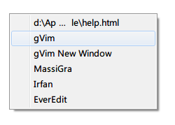

然后可以自由选择是在新的 gVim 进程实例还是新的缓冲区打开文件。

关于缓冲区、标签页的说明，后面会提到。如果不熟悉，可以暂时不更改启动参数，保持原样。

### 救命！

不要恐慌！
如果你在使用 Vim 时晕头转向，手足无措，一般有两个救命锦囊（并不总是有效）：
1. 按键盘左上角的 `Esc` 键，返回刚进入 Vim 时的普通模式，然后再重新出发。
`Esc` 表示 Escape，记忆为“逃脱”就行。
2. 在普通模式下输入 `:help 关键字`，根据关键字查找 Vim 帮助文档中相应的主题。

学习到相关的知识后再尝试操作。
其后我会在知识点中加上对应的帮助主题关键字，以*斜体*表示。如有更多疑问，可在 Vim 中自己查找帮助文档。
更高级的用法是 `:helpgrep 关键字`，像 grep 命令一样查找帮助文档中包含关键字的所有行，但只会在新窗口中展示第一个匹配的结果，更多的用法可以自己输入 `:help helpgrep` 探索。

## 作为基本编辑器的 Vim

掌握 Vim 的强大功能之前，建议先将其作为基本的编辑器使用一段时间，在日常使用过程中一步步发掘不同于一般编辑器的功能点，渐进式地学习。
所以，我会先讲解如何将 Vim 当作最简单的编辑器使用，然后再逐步引入更高级、更复杂的功能。

### 初次进入的界面

在默认配置下，首次进入 gVim 会看到如下界面：

菜单栏和按钮工具栏与一般的文本编辑器大同小异，菜单中部分命令有相应的命令提示。

如果不熟悉常用功能的命令，可以暂时保留菜单栏和工具栏，等到熟悉了再隐藏。

目前我自己配置的界面是这个样子：

原来菜单栏和工具栏的位置被缓冲区标签页代替。
底部则是状态栏，显示当前的模式、文件名、文件修改时间、文件格式（dos、unix 或 mac 格式）、字符编码、文件类型和光标位置信息。

如果按 `:` 进入命令模式，则在状态栏下方输入命令：

### 进入插入模式开始编辑

因为默认模式是普通模式，所以要输入文字需要进入插入模式。
进入插入模式最常用的指令是 `i`，是 *insert* 的缩写，含义是在当前字符之前插入，也就是移动光标至当前字符之前再进入插入模式。
例如，现在要在光标所在位置之前开始编辑文字：

左下角的模式显示为 NORMAL，表示处于普通模式。

按下 `i` 键后，光标变为表示可以输入的竖线：

如果无法正常进入插入模式，界面上出现未上屏的 i 字符，多半是因为开启的中文输入法抢先拦截了。
可以切换到英文输入状态，然后在普通模式下输入指令。
如果觉得总是英文输入状态很麻烦，可以试试谷歌输入法、手心输入法等。

如果要在当前字符之后插入呢？
按下 `a` 就行，含义是追加，对应的英文为 append。

也许你会觉得，在字符前还是后进入插入模式还要弄两个命令，太小题大做。
那插入新行的指令 `o` 和 `O` 就显得实用多了。
在普通模式中输入 `o`，表示在当前行下插入新行，并停留在插入模式。
相比之下，一般编辑器需要按 `End` 移动光标到行尾，再按 `Enter` 换行。
大写字母 `O` 指令则正好相反，在当前行上面插入新行，并停留在插入模式。
相比之下，一般编辑器要按 `Home` 移动光标到行首，按 `Enter` 换行，再按 `Up` 移动到新行。

更加厉害的是，上述指令可以与数字配合。
遵循 [count]command 的格式，如 `12O`，进入插入模式输入文字后再按 `Esc` 退回普通模式，刚才输入的文字就会变成12行。
如果你想快速插入分隔线，这个也很有用。

### 光标移动

在插入模式下，光标的移动与一般的文本编辑器基本没有区别，除了涉及折行的上下移动，具体见后文解释说明。
但这样的移动方式效率太低，如果要熟练掌握 Vim，必定要学习其别具特色的光标移动指令。

最简单的移动指令相信初学者也有所耳闻，就是标准键盘右手四指附近的 `h`、`j`、`k`、`l` 四键，分别对应**普通模式**下，左、下、上、右四方向移动光标的操作。
因为小拇指操作比较别扭，所以分配给食指的是 `h` 和 `j` 两个键，如果你的键盘盲打手势很标准，熟悉这四个指令应该不是难事。

除此之外，还有指令取代 `Home`、`End`、'PageUp` 和 `PageDown` 键。
`0` 和 `^` 都是移动到当前行的行首，区别在于 `^` 移动到的是第一个非空白字符。
`$` 则是移动到当前行最后一个非空白字符。
`Ctrl-F` 对应 `PageDown`，`F` 代表 Forwards，前进。
`Ctrl-B` 对应 `PageUp`，`B` 代表 Backwards，后退。

还记得之前提到的文本对象概念吗？
以文本对象为单位跳转的功能自然少不了。
`w` 指令用于跳转到下一个单词的头部，助记的单词是 word。
`e` 指令跳转到下一个单词的尾部，助记的单词是 end。
`b` 指令跳转到上一个单词的头部，助记的单词是 backwards。
每个指令都有相应的大写指令，不过是以字符串而不是单词为单位跳转。

比如，跳转的位置如下所示：

因为存在英文标点符号，因此 `w` 和 `W` 跳转的位置会有差异。

之前有说过，由于中文的文本对象识别不完善，因此相应的跳转功能也未尽如人意：

这些指令同样可以和数字结合起来使用。
比如，`10j` 表示光标向下移动10行；
`2<Ctrl-F>` 表示光标向下移动2个屏幕；
`4w` 表示向后跳4个单词。

有的编辑器可以迅速跳转到文档最开始和最后的位置，Vim 对应的指令是 `gg` 和 `G`，助记的单词都是 go。
如果是跳转到当前屏幕的顶部、中部和底部，可以分别输入 `H`、`M` 和 `L`，对应的单词分别是 `Home`、`Middle` 和 `Last`。
如要直接跳到指定行，直接进入命令模式输入行数即可，如 `:100` 就会跳到第100行。

有时候我们并不想光标逃开，而希望屏幕相对光标和我们的视线滚动，这样就不必重新定位光标所在位置。
上下相对滚动屏幕的常用指令有 `zt`、`zz` 和 `zb`，分别对应屏幕相对滚动后，光标所在行显示在窗口的顶部、中部和底部。

更有威力的指令是跳转。
`Ctrl-O` 是跳转到光标上次移动到的位置，而 `Ctrl-I` 正相反。
当你移动光标去另一处临时编辑后，要回到之前的位置时，会发现这个指令非常实用。

注意，Vim 有个古怪之处，光标会始终停留在屏幕范围内。
如果你用鼠标拖动滚动栏上下翻页，光标不会待在原地不动，而会跟随屏幕移动。

另外，Vim 中与行相关的移动也与众不同。
一般的文本编辑器，按 `End` 跳转到行尾时，如果该行在窗口内换行，那么光标还是会停在换行处：

而 Vim 中按 `End` 或 `$` 则是无视窗口换行，直接跳到真正的行尾：

同样地，行间移动也比较有个性：

普通的文本编辑器中，上下移动是这样的：

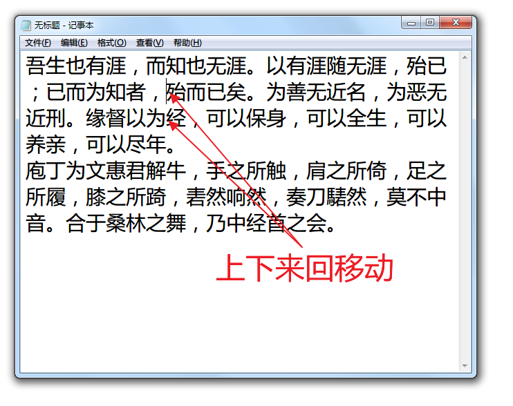

而 Vim 中是这样的：

如果你日常使用窗口内换行的设置，可能会因此而困扰。
不过好在在设置中这可以修改为符合普通编辑的方案。

由于本教程面向非程序员，因此涉及代码常见的成对符号、标签间的跳转就略过了。
更多的指令可自己查看 *scrolling* 和 *cursor-motions* 的帮助文档。

### 保存

输入一些文字之后，如果点击工具栏上的 `保存` 按钮，Vim 会提示说：
E32: 没有文件名
入门者可能被吓住，一般的编辑器不是在保存未命名文件时会弹出系统浏览器，让你选择保存的路径和文件名吗？
这是怎么回事呢？

这是因为需要事先指定保存的路径和文件名，Vim 才知道要保存到哪里。
如果一开始没有指定文件名，需要使用 `save`、`saveas` 或 `write` 命令指定路径和文件名。
如输入 `:save test.txt` 回车，默认会在 Vim 的当前目录（*current-directory*）保存 `test.txt` 文件。
你也可以在输入文件名之前，`save` 指令的空格之后，输入路径，并按 `Tab`/`Shift-Tab` 让 Vim 自动补全路径。
`saveas` 和 `write` 命令可以分别简写为 `sav` 和 `w`。

如果希望看到熟悉的弹出窗口，通过 Windows 自带的资源浏览器选择保存的路径和文件名，那么可以使用 `:browse save` 命令：

之后可以使用 `Ctrl-S` 快捷键或点击 `保存` 按钮，也可以再使用 `:w` 命令来保存文件。

### 打开文件

如果习惯使用资源浏览器打开文件，可以输入 `:browse edit` 命令，然后读入指定的文件开始编辑。
如果不想调出资源浏览器窗口，新文件的位置又在附近，直接输入 `:edit` 然后使用 `Tab`/`Shift-Tab` 补全文件名更能更快。

如果希望像一般的多标签编辑器那样，新打开的文件显示在新的标签页中。
可以使用 `:tabedit filename` 或 `:browse tabedit` 命令：

如果喜欢多缓冲区模式，换成用 `:enew` 命令即可，相当于 edit new。

当然，最快的还是配合 Totoal Commander 和 candy 使用。

同时处理多个文件时，Vim 的缓冲区（*buffers*）、标签页（*tab-page*）和窗口（*window*）的概念与一般的编辑器有些差异，入门者会犯糊涂很正常。
后续会有详细章节介绍这些概念。
我建议尽量在一个窗口中使用多个缓冲区，为了方便可以开多个窗口，而尽量不要使用多标签页。
等到你熟悉了这些概念后，可以自由选择适合自己的多文件管理方式。

### 选择

既然 Vim 号称可以无鼠标使用，那么要用什么方法代替鼠标点选文字呢？
答案就是可视模式（*visual-mode*）和选择模式（*select-mode*）。

在普通模式下，按键 `v` 用于进入可视模式，进入后即会选择光标当前所在的字符。
此时如果再移动光标，则光标经过的位置都会选择。
再输入指令，就会处理选择的内容。
例如，`v$` 表示选择从当前光标所在位置到行尾的所有字符。

选择指令的威力配合文本对象和操作指令才能完全发挥（*visual-operators*），比如：
选中整个段落： `vap`，visual around paragraph
选中 HTML/XML 标签内的内容：`vit`，visual inner tag
按照指定的宽度（*textwidth*）重新排版：选中之后输入 `gq`

Vim 的指令大小写通常有关联，大写的 `V` 同样可以用于选择，不过其效果是选择光标所在的整行。
例如 `ggVG` 全选操作可以分解为：
`gg`：光标跳转到文档第一行第一列；
`V`：进入可视模式，选择整个第一行；
`G`：光标跳转到最后一行，列位置不变（因为之前光标在第一列，`G` 跳转后应该也在第一列）。
由于 `V` 是选择整行，因此不管 `G` 跳转后，光标在哪一列，最后一行都会全部选中。

用惯了 Windows 系统默认快捷键的用户可能会认为，`Ctrl-A` 全选更快捷。
Windows 下的 gVim 默认也是可以按 `Ctrl-A` 全选的，但 `Ctrl-A` 在普通模式下另有妙用。
如果你习惯了 `ggVG` 的全选操作，可以自己查看和修改 Vim 安装目录中的 mswin.vim 文件，解放 `Ctrl-A` 快捷键。

整列选择的指令是 `Ctrl-V`，但因为和 Windows 系统的粘贴快捷键冲突，gVim 默认的快捷键映射为了 `Ctrl-Q`。
所以当你在其他教程中看到说 `Ctrl-V` 的列块操作时，请记得在 gVim 中换成 `Ctrl-Q`。
当然也可以编辑 mswin.vim 文件取消这个映射。

整列选择后，Vim 相当于进入了其他编辑器的列块模式。
使用 `j`、`k` 或其他光标移动指令选择整列文字后，按 `I` 或 `A` 分别在选中列块之前或之后进入插入模式。
输入文字后按 `Esc` 回到普通模式，刚才输入的文字就会插入之前选择的各行。

例如，光标在以下文档最前方，需要在每行第二列插入空格字符：

按下 `Ctrl-Q`，可以看到左下角的模式已经转换为“可视 块”，表示不但已经切换到可视模式，而且是列块模式：

按下 `G` 或者 `2j` 移动到最后一行，可以看到选择的范围也相应变成所有行第一列的字符：

再按下 `A` ，光标即落在第一、二列之间，输入一个空格后效果如下：

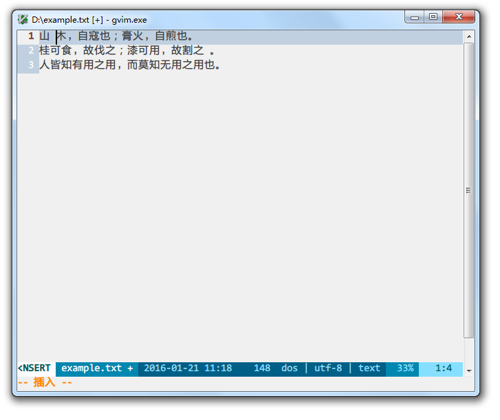

这时只看到第一行插入了空格，其他行却维持原样，这行事风格和其他编辑器的列块模式不一样啊。
不要恐慌，按下 `Esc` 退出可视模式之后，事情起了变化：

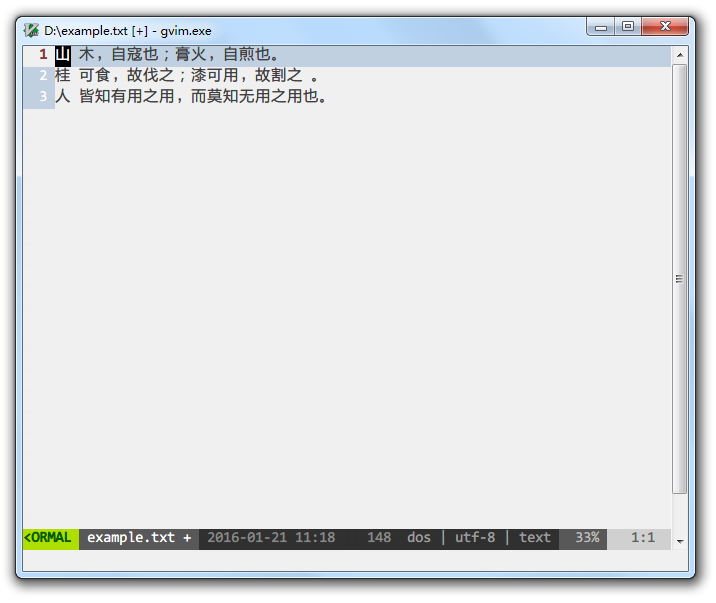

Vim 中的选择一样可以使用鼠标，和一般的文本编辑器类似，左键按住然后拖动就行。
列块模式的选择则是按住 `Alt` 键，再用鼠标左键选择。
如果你忘记了键盘指令，临时用鼠标对付就是了。

有时候我们选择了文字之后，因为各种原因取消了选择，又想再重新选择，可是文字太多，或者早就跳转到文档其他位置了，很难再回到之前的状态，该怎么办呢？
Vim 提供了一个神奇的指令：`gv`，助记方法是 get/gain visual
在普通模式下，只要没有再次选择，输入该指令就能重新选择上一次选择过的文字。

至于选择模式，对入门用户来说更像一般的文本编辑器中的操作方式，选择文字之后继续输入，就会替换被选择的文字。
进入选择模式的方法是，在可视模式下选择文字之后，按 `Ctrl-G`。

### 复制和粘贴

Vim 另一个违背新手习惯的地方是，*默认设置下，它的“默认剪贴板”与系统剪贴板不通用*。
也就是说，虽然它有粘贴命令，但在其他程序中复制的内容，无法简单地通过粘贴命令贴到 Vim 中。
在 Vim 中通过复制命令复制的文本内容，也不会传递给系统剪贴板，而是存放在其内部的寄存器中。

好在这个问题通过一行简单的配置代码就可以解决。
如果你等不及，可以去后面的配置章节看看。
如果只在内部试试复制粘贴，请继续往下阅读。

Windows 系统中，复制、粘贴的快捷键是 `Ctrl-C` 和 `Ctrl-V`。
而 Vim 中对应的指令则是 `y` 和 `p`，用于助记的词分别是 yank 和 paste/put。

复制通常有三种操作方式，其一是先进入选择模式选择好要复制的文本后，输入 `y` 指令。
只要熟悉了选择模式，再结合 `y` 按键就可以了。

另一种操作方式是与文本对象结合，比如之前范例提到过的：
`yis`：yank inner sentence，复制整句
还有：
`yab`：yank around brackets，复制小括号（`()`）及其内部的内容
只要你熟悉了文本对象，也可以迅速和复制命令结合使用。

第三种是在普通模式先输入 `y` 指令，然后移动光标，如：
`y0`：复制从光标处到行首的文本
`y3j`：复制从光标处到下移3行后之间的文本
甚至可以 `y:100<CR>`：复制从光标处到第100行的文本，其中 `:100<CR>` 表示进入命令模式，跳转到第100行。
只要你熟悉了光标移动的操作，同样可以迅速和复制操作结合起来使用。

比较特殊而常用的用法是 `yy`，即复制光标所在的整行，包含行尾的回车换行。
指令前面也可以加数字，表示操作的次数，如 `3yy` 就是复制光标处及以下的3行内容。

复制之后，移动光标到要粘贴的位置，如果按下 `p` 表示粘贴到光标位置之后，按下大写的 `P` 表示粘贴在光标之前。
如果复制的内容是整行，那么 `p` 会将整行粘贴到当前行之下，`P` 正好相反。
粘贴指令之前也可以加数字来多次重复粘贴。

### 删除/剪切

普通模式下的删除有两个指令：
`x`：助记词组是 cross out，用于以字符为单位删除，如 `3x` 表示连续删除3个字符。
`d`：助记单词是 delete，用于与光标移动结合删除，如 `d3l` 同样也可以连续删除3个字符。
而 `dd` 对应于 `yy`，是删除光标所在的整行。
两个指令都可以与选择模式结合使用。

至于剪切，好吧，Vim 中删除就是剪切，因为内容删除后可以用粘贴指令粘贴出来，其效果就等于剪切。
实际上 Vim 中的删除是将文本送到了某个特殊的寄存器中，这个寄存器也用于复制和粘贴，所以才会有删除=剪切的功效。
这也是让新手迷惑的地方，因为复制之后，如果又做了删除操作，刚才复制的内容就消失了……
熟悉了之后，这倒不是什么大问题，何况也可以指定用于删除、复制、粘贴操作的寄存器，这就属于进阶的学习内容了。

### 关闭退出

Vim 当然还是支持 Windows 系统中标准的快捷键 `Alt-F4`，或者直接用鼠标左键点右上角的关闭按钮。

但更加常用的方法，是在命令模式下操作，输入 `:q` 退出当前的窗口。助记单词为 quit。
如果当前窗口是最后一个，则整个 Vim 程序都会关闭、退出。

如果文件之前没有存档，可以保存和退出一步完成：`:wq`，相当于 write and quit。
也可以用 `:x` 命令，与 `:wq` 的区别是，如果文件没有修改变动，前者不会实际写磁盘。
如果不想存档就退出，就需要加惊叹号用于确认：`q!`。

如果觉得输入 `:` 很麻烦，也可以在普通模式下，用 `ZZ` 指令代替 `:x` 命令，用 `ZQ` 指令代替 `:q!` 命令。

如果你和我一样习惯使用多缓冲区，则可以用 `:bd` 命令退出当前缓冲区，它是 buffer delete 的简写。

### 查找

Vim 的前身 Vi 最初是纯字符命令行界面的编辑器，因此不可能像我们日常接触的编辑器一样，弹出查找窗口用于输入要查找的字符串。
相应的查找方法也就是像输入命令一样，只不过输入命令是使用 `:` 指令，而向文档下方查找的指令是斜杠 `/`。

例如要查找“无涯”，在普通模式下直接输入 `/无涯` 然后回车，光标会跳转到第一个搜索结果上：

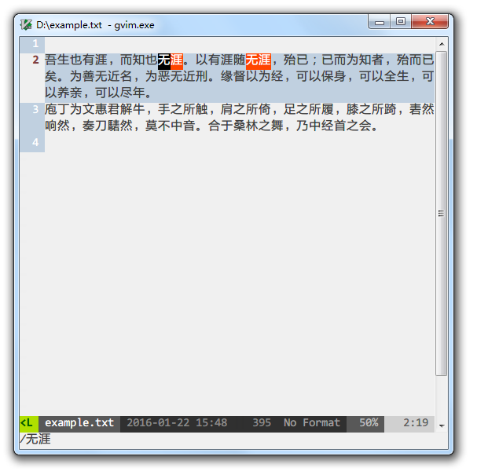

`?` 指令则是向文档上方查找。

如果要重复上一次搜索，再向前/后查找同一个关键词，按 `n` 键，表示 next。
重复相反方向查找的指令是大写的 `N`。

一般使用 `/` 就够了，这样 `n` 和 `N` 就分别固定表示继续向下查找和反向向上查找，更加容易记忆。

按下 `/` 后，再按上键头 `↑`，可以快速调出之前查找过的关键词。

默认状态下，Vim 的查找对大小写敏感，如搜索 `vim` 是定位不到 `Vim` 的。
在后面的配置介绍中，会告诉你如何修改设置，更合理地区分查找大小写文本。
还有搜索结果高亮、使用多种颜色标记不同内容等高级功能。

如果处理英文文档较多，`*` 和 `#` 指令非常实用，它们会以光标所在位置的单词为关键词向上/向下查找。

Vim 的查找默认采用正则表达式，可以查找行首（^）、行尾（$）、换行（\n）、制表符（\t）、空白（\s）等特殊标记，也可以查到某个条件不出现、出现一次或多次等情况。
如有兴趣进一步了解正则表达式规则，可以看看 *pattern* 相关的帮助文档，或者正则表达式的教程。
正则表达式应用广泛，功能强大，了解一点有好处。

一些复杂的关键词可能包含正则表达式本身用到的特殊字符，如 `/`、`.`、`*`、`()`、`|` 等，要做转义处理，在前面加 `\` 才能正常查找。
如查找12.34时，输入 `/12.34` 是查不到的，要输入 `/12\.34` 才行。

如果用到正则表达式的机会不多，可以在搜索的关键词后加 `\v` 或 `\m` 参数，这样大部分需要转义的特殊字符就不需要手动转义了，具体的规则参考 */magic* 部分的帮助文档。
也有 Vim 插件让用户完全不用考虑转义的烦恼，后续会有介绍。

### 替换

最简单的替换功能就是将字符串 A 替换成 B，命令写法是 `:s/A/B`，意思是将本行内第一个 A 字符串替换成 B 字符串。

一般的用法是全文全部替换：
`:%s/A/B/g`
其中 `%` 表示搜寻全文范围，`g` 标记可以看作 globally 全局的意思，表示一行内所有匹配的 A 都替换成 B。

助记的方法是记住替换命令接近完全的形态：
`:[range]s[ubstitute]/{pattern}/{string}/[flags]`
别看命令很长，它是有规律的，翻译成白话文很好理解：
[range]：在某个范围内
s[ubstitute]：使用替换命令（substitute 是完整的命令名称，一般当然只用简短的 `s`）
/{pattern}：将匹配某个模式的字符串
/{string}：替换成某个字符串
/[flags]：并且启用某些特殊功能

例如上述全文替换命令对应的英文可以是：
In the whole range of document, substitute text string that matches pattern A with another string B, globally.

如果要替换指定范围内的内容，最快的方法就是先选中那个范围，然后 `:` 进入命令模式。
这时就不需要再指定范围，直接输入 `s` 及之后的参数即可。
如此操作，选中范围之外的“牛”字就不会替换为“猪”：

用于替换的模式和目标字符串方面，有几点要注意：
一是要使用正则表达式，如使用 `\t` 表示制表符；
二是因为每行结束跳到新行时，Windows 下的回车（`\r`）+换行（`\n`）、Unix 系统下的换行以及 Mac 系统下的回车的表示方法各不相同，所以可能出现 `^M` 之类的奇怪字符。
这时如果要匹配这个字符替换为正常的回车换行，可以在替换时用 `Ctrl-Q` `Ctrl-M` 或 `Ctrl-Q` `<Enter>` 打出来（还记得吗？gVim 中 `Ctrl-Q` 默认替代了 `Ctrl-V` 快捷键，所以在其他平台应该用 `Ctrl-V`）。
三是匹配回车换行时使用 `\n`，但是替换成回车换行请用 `\r`  或 `Ctrl-Q` `<Enter>`。

常用的标记除了表示行内全匹配的 `g` 之外， 还有：
`c`：每次替换都向使用者询问、确认
`n`：不实际替换，只报告匹配的次数，常用语统计某个字符串出现的次数

### 覆写

覆写模式使用频率不高，简单地记住三类指令就行：
普通模式下，`r` 是覆写当前的一个字符，输入后立即退回到普通模式，用于临时修改；
普通模式下，`R` 是进入覆写模式，输入后按 `Esc` 才退回普通模式，用于大段覆写修改；
插入模式下，`Insert` 的功能和一般的文本编辑器相同，相当于普通模式下的 `R` 指令。

### 最近打开的文件

当编辑过多个文件后，下次打开时希望找到之前编辑过的文件，该如何调出历史文件呢？
最基础的办法是使用如下命令：
`:browse oldfiles` 或简写为 `bro ol`
调出历史文件清单，每个历史文件有对应的编号。
输入 `q` 之后，再输入对应编号回车，就能打开指定历史文件。

结合插件有更加方便好用的办法，后续会补充介绍。

### 撤销

初级、低频率使用文本编辑器的用户可能不觉得撤销功能有多重要，但对每天大量使用的用户来说，撤销功能是否方便、完备，和使用体验息息相关。
而 Vim 的撤销功能既方便又强大。

方便之处在于，只要一个表示 undo 的 `u` 指令，就能在普通模式下撤销上一次的操作。
gVim 默认保留了 Windows 下通用的 `Ctrl-Z` 的撤销快捷键，插入和普通模式均有效。

要是撤销之后又想恢复被撤销的内容，也就是重做，可以在普通模式下按 `Ctrl-R` 来恢复，助记的单词是 recover。
gVim 默认也支持 `Ctrl-Y` 通用快捷键，不过建议不要占用插入模式下的 `Ctrl-Y` 指令，因为它本来的功能是复制上一行同一列的字符。

Vim 写文件时，会同时将撤销历史写入撤销文件。
这样下次打开文件时，可以恢复上一次编辑的撤销历史，不至于保存并关闭后，就再也无法撤销了。
在配置文件章节会提及如何设置撤销历史文件和路径。

有时候我们也会遇到反复多次修改、撤销、重做后，中间阶段输入的内容再也无法通过撤销重现的情况，因为一般的撤销历史都是线性的。
而 Vim 目前已经支持撤销分支（*undo-branches*），所有的变化都是改变树的叶节点，输入 `:undolist` 命令可以看到所有变化。
如果使用 `u` 和 `Ctrl-R` 找不回来的文白，普通模式下使用 `g-` 和 `g+` 指令也许可以找回来。

除此之外，还可以指定回到多少次更改之前的状态，或者多久时间之前的状态，如果有需求可以深入研究 *earlier* 部分的帮助文档。

如果觉得自带的撤销分支不直观，还有 Gundo 之类的插件可用。

## 美化

颜值要求高的用户可能看不上 Windows 环境下的 gVim 界面，丑陋的默认 fixedsys 字体，糟糕的渲染，古老年代风格的图标和配色……
怎么看都像是要被抛弃到垃圾堆的历史文物。

但其实还是可以抢救一下的。

### 自动换行、行号

`:set wrap` 和 `:set nowrap` 命令可以切换是否自动换行。
`:set number` 和 `:set nonumber` 命令可以切换可以是否现实行号。
建议在配置文件中为此类常用命令配置快捷键映射，不用总是手工敲命令。

### 屏幕字体渲染

Windows 10 之前的字体渲染效果非常糟糕，建议安装 MacType。
对比效果如下：

开启 MacType 之前：

开启 MacType 之后：

一目了然，如何选择不用多说了吧。

### 配置文件简介

以下的美化工作涉及修改 Vim 配置，所以先介绍 Vim 的配置文件。

图形界面上菜单中的各种设置并不会写入 vimrc 文件，无论你怎么更改，下次启动 Vim 还是会恢复原状，相信曾经让不少入门者头大。

Vim 的配置在 *vimrc* 文件中记录，该文件用于初始化环境变量或在启动时执行命令。
要想永久改变 Vim 的配置，就要编辑 $HOME/_vimrc、$HOME/vimfiles/vimrc 或 $VIM/_vimrc 文件。
$HOME 和 $VIM 是系统的环境变量，在 Vim 中输入 `:echo $HOME $VIM` 能一次查到它们究竟是哪两个目录。
Vim 会按顺序寻找这三个地方的配置文件，先找到的那个才有效。

配置文件中每行相当于一个启动时要执行的命令，如 `:set incsearch` 命令表示输入要搜索的字符时，不需要按回车键就即时跳转到最近的目标所在行。
在 vimrc 文件中新建一行写入 `set incsearch`，效果也一样，每次启动 Vim 后都会自动启用这个设置。

行首的英文双引号 `"` 为注释符号。

修改配置文件后，一般要重启 Vim 才会生效。
熟练了之后可以用 `:source` 命令读取并执行指定的 vimrc 配置文件。

### 字体

官方版本的 gVim 目前只支持等宽字体，如果你经常处理中文，那么可选择面就比较窄了。
目前使用比较多的有雅黑等宽字体、字体印象（Impression of Font）的多个系列（如 XHei）、文泉驿系列、Inziu Iosevka 系列。

配置默认字体需要首先知道用于配置的字体名称，如果 vimrc 文件是 GBK 编码，可以使用中文名，如果像我一样习惯使用 UTF-8 编码，要使用对应的英文名称。
如系统自带的黑体是 SimHei，雅黑等宽是 Yahei_Mono，空格用下划线表示了。
字体名称与字号之间用冒号 `:` 分隔。

以默认的黑体为例，vimrc 文件中的配置如下：

    set guifont=SimHei:h11
    set guifontwide=SimHei:h11

其中 *guifont* 用于指定图形界面版本使用的字体列表，*guifontwide* 用于指定双宽字符的字体列表，使用 guifont 指定的两倍宽度和相同的高度。

如果今后隐藏了菜单栏，使用 `:set guifont=*` 命令可以调出字体选择界面预览字体效果。

### 配色

Vim 的默认配色方案还是原始时代的感觉，如果你更喜欢现代编辑器更加养眼、优雅的配色，可以到网上找配色方案装上。
配色方案其实就是一个后缀名为 vim 的配置文件，其中都是配置、变更配色信息的命令。
下载下来的配色文件可以放入 `vimfiles/colors` 目录，然后使用 `:colorscheme [配色方案名称]` 的方式临时启用，或者输入 `:colorscheme` 命令后按空格和 `Tab` 选择已有的配色方案。

如果要更改默认配色方案，需要在 vimrc 配置文件中写入 `colorscheme [配色方案名称]` 的配置内容，再重启 Vim。

### 语法高亮

语法高亮也是和配色方案类似的配置文件，不过需要放在 `vimfiles/syntax` 目录下。

Vim 已经自带了大部分常用的语法高亮文件，并且会根据文件后缀名自动启用。
官方网站和网络上也会有大量的语法高亮文件，基本上不用担心找不到合适的。

## 较现代的文本编辑功能

好了，现在最基本的编辑命令已经介绍完毕，至此，入门者已经可以用 Vim 像最简单的记事本一样写文档。（画外音：你在逗我吗？讲到现在才赶上记事本？！）
但我们当然不可能停留在最基础的功能。
下面的内容是在最基础的功能之外，一些现代编辑器的通用功能。
实现同样的功能甚至实现得更好，才能体现 Vim 的优点和特色嘛。

### 多标签/多缓冲区

一个 Vim 进程编辑多个文件时，有三类管理和展现方式：
Buffer（缓冲区）、Window（窗口）和 Tab-page（标签页）。

#### 缓冲区

一个缓冲区对应一个加载到内存中的文本，如果已经保存到磁盘上，缓冲区的名字就是文件名。

使用 `:ls` 或 `:buffers` 命令可以看到当前存在的所有缓冲区，同时打开了 file1、file2 和 file3 三个文件：

第一列的数字是缓冲区的编号，可以使用 `:buffer n` 命令跳转到第 n 个缓冲区。

如果使用 *Tabline* 方式管理缓冲区的插件，可以很直观地看到当前的缓冲区情况：

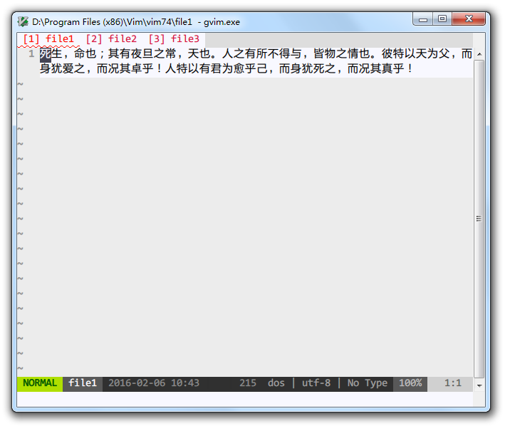

新建缓冲区的命令 `:enew` 之前已经介绍过。
删除当前缓冲区的命令是 `:bdelete`，可以简写为 `:bd`，是 buffer delete 的缩写。

#### 窗口

窗口是用于展示缓冲区的内嵌窗口界面。
同一个缓冲区可以在多个窗口中并行展示，可以想象一下 Microsoft Word 中拆分窗口后的情况。
编辑其中一个窗口中的缓冲区，其他窗口中同一个缓冲区会同步更新。

使用 `:split` 和 `:vsplit` 命令可以开辟水平和垂直分屏的窗口。
其中的 v 表示 vertical。

同时在三个窗口中展示三个不同的缓冲区效果如下：

之前所说的 `:q` 命令实际是关闭当前窗口。
默认情况下，如果缓冲区只在当前窗口展现，退出当前窗口时，也会关闭并从内存中卸载该缓冲区。
也就是说，如果退出 file1 在左上角的展示窗口，file1 的缓冲区也会从缓冲区列表中消失。

如果在配置文件中设置了 `hidden` 参数，则退出窗口时，缓冲区还保留在内存中。
也就是说，如果退出 file1 的展示窗口，file1 的缓冲区仍在缓冲区列表中。

`:only` 命令可以只保留当前窗口，关闭其他所有窗口。

以 `Ctrl-W` 开头表示这个组合快捷键与 Window 窗口有关。
光标在多窗口之间跳转可以在普通模式下使用 `Ctrl-W` `h/j/k/l` 指令。
移动窗口的相对位置，左下上右的指令改为大写：`Ctrl-W` `H/J/K/L`
交换对调上下、左右窗口的位置，使用 `Ctrl-W` `r` 指令。
换成 `Ctrl-W` `+/-/</>` 则可以调整当前窗口的高度和宽度。

如果更习惯使用鼠标操作，你也可以直接用鼠标点击窗口移动光标，或者将鼠标移动到窗口边缘拖动来改变窗口大小。

#### 标签页

一般情况下 Vim 的标签页长相普通：

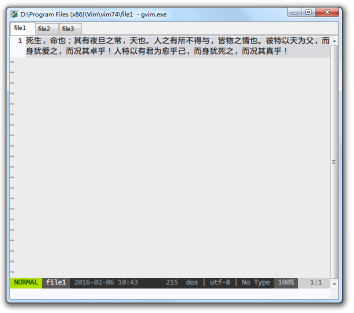

但 Vim 的标签页与普通的多标签文本编辑器还不太一样。
其他编辑器的标签页以文件为单位，一个文件对应一个标签页。
而 Vim 的标签页是窗口的容器，一个标签页中可以有多个窗口，窗口中可以是不同的缓冲区，也可以是同一个缓冲区。
因此，一个缓冲区既可能出现在多个窗口中，也可能出现在同一个或者不同的标签页下的多个窗口中。
如果你不太习惯这个特性，还是采用缓冲区的管理方式比较好。

新建标签页的命令是 `:tabedit` 或者 `:tabnew`，关闭当前标签页使用 `:tabclose`，关闭所有其他标签页使用 `:tabonly`。
普通模式下，前后切换标签页使用 `gt` 和 `gT` 指令。

更多的标签页命令见 *tab-page-commands* 帮助文档。

### 分屏

分屏的基础命令 `:split` 和 `:vsplit` 之前已经有提及。
两个命令可以分别简写为 `:sp` 和 `:vs`，也可以分别使用快捷键实现：
水平分屏：`Ctrl-W` `s` 或者 `Ctrl-W` `Ctrl-S`
垂直分屏：`Ctrl-W` `v` 或者 `Ctrl-W` `Ctrl-V`

使用 `:q` 命令退出当前窗口来结束分屏。

### 折叠

即使你不是程序员，不编写编程代码，也可能需要借助折叠特性更好地阅读、管理大段有结构的文本。

折叠的效果如下，三段文字：

生成三个1级折叠：

其中 `{{{1` 是折叠开始标志（*fold-marker*），数字表示折叠级别。
如果后面没有出现折叠结束标志 `}}}`，那么这个折叠标志结束位置，就是下一个级别数字小于等于它的折叠开始标志。

例如，第二段改为第2级折叠，加上折叠结束标志：

折叠后，因为有折叠标志，第2级折叠和第1级并列展现。

如果去掉折叠结束标志， Vim 认为1级折叠之后的2级折叠从属于第1级：

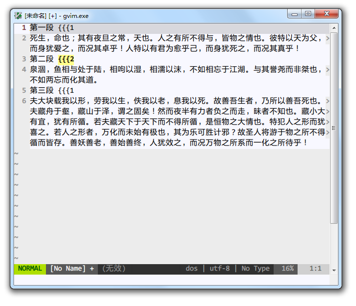

因此折叠第1级时，就同时折叠了包含的第2级内容：

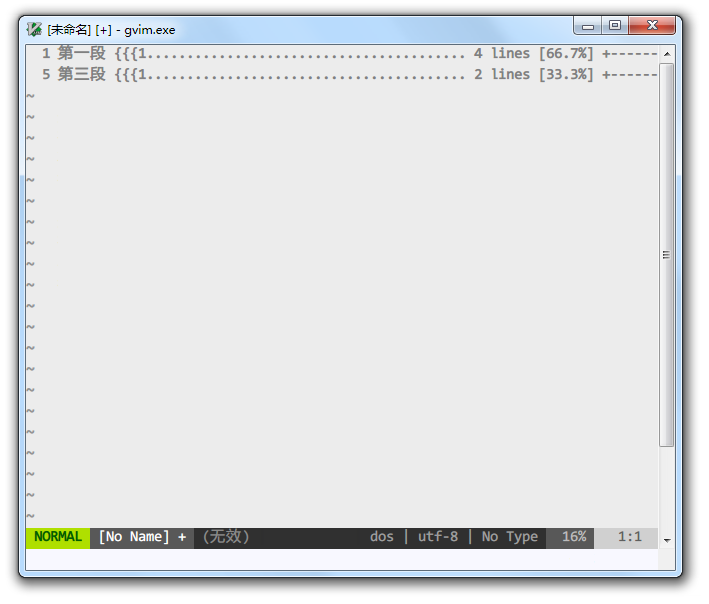

展开第1级时，2级折叠可以保留不同的折叠状态：

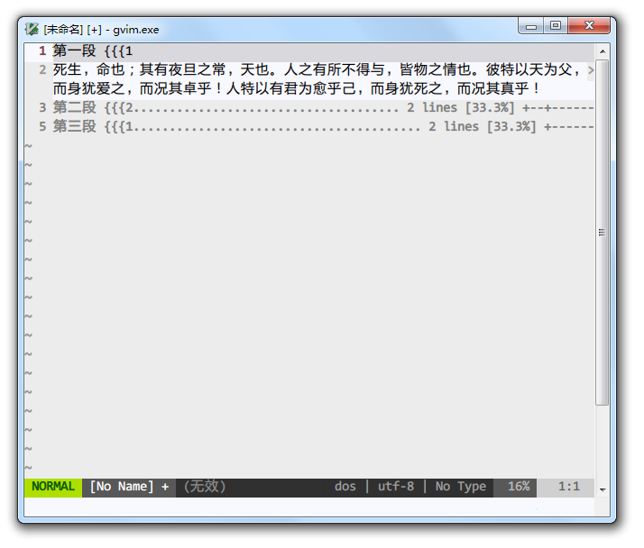

除了折叠标志，Vim 还支持语法、缩进、自定义表达式、文本比较结果等多种折叠方法（*foldmethod*）。
不过使用折叠标志的效率最高，不容易弄乱折叠关系，建议以此为主要的折叠方式。
如果习惯 Markdown 等简单标记，结合 Vim 的语法折叠也相当方便。

折叠相关的指令（*fold-commands*）全部以 `z` 开头，中文用户记忆为“折”的拼音首字自然最方便。

创建折叠的指令是 `zf`，它会为选中部分创建带折叠起始和结束标志的注释。
但并不能自动创建折叠级别，所以最好是手工加上级别，或者借助插件完成。

相应的删除折叠命令是 `zd`，光标所在位置所属的折叠，或者选中部分涵盖的折叠，都会清除。

`za` 指令可以不断切换打开还是关闭光标当前位置的折叠。
为方便起见，建议与普通模式下的空格 `Space` 快捷键绑定。

基于折叠还有一些高级功能，例如在折叠间移动，关闭或打开某一级别以上的折叠，针对打开或关闭的折叠执行命令等等。具体可参考 *folding* 部分的帮助文档。

### 语法高亮

Vim 根据文件后缀名自动识别不同语法类型的文件并应用语法高亮规则，例如文件类型为 Markdown 时，自动应用 Markdown 的语法高亮：

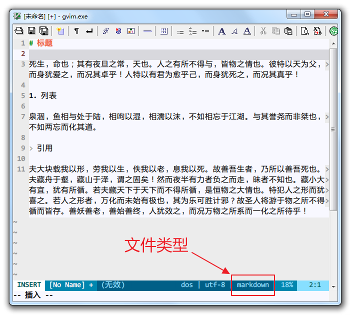

并且已经内置大部分常见的语法高亮规则。
[官方网站高亮语法区](http://www.vim.org/scripts/script_search_results.php?keywords=&script_type=syntax&order_by=rating&direction=descending&search=search)也会发布其他用户贡献的语法高亮脚本。

如果觉得当前的文件类型识别不正确，可以用 `:set filetype` 命令手工指定文件类型：
`:set filetype=markdown`
这个时候输入 `:set syntax?` 命令（注意最后的问号），会显示当前的语法高亮规则就是匹配的 markdown 类型：

如果不想更改文件类型而只更改语法高亮规则，比如对 html 后缀的文件应用 Markdown 语法高亮规则，可以直接设置语法类型：
`:set syntax=markdown`

有时候应用语法规则会影响 Vim 效率，有的 Vim 并不会默认打开语法高亮功能，这就需要用户自己来操作。
关闭和打开语法高亮的命令分别是： `:syntax off` 和 `:syntax on`

### 关键字补全

最简单的补全功能，是基于当前文件中已经输入的词语，对当前字符串进行补全（*compl-generic*）。
在插入模式下输入 `Ctrl-P` 或 `Ctrl-N` 会向前或向后搜寻起始字符串匹配的关键字。

例如，之前已经输入过“相呴以湿”、“相濡以沫”，再次输入“相”字时，按下 `Ctrl-P` 就会出现关键字补全的可选项。
因为按向前搜索的顺序，“相濡以沫”更接近，因此默认选中的是这个词：

如果默认选中的结果不正确，再多按几次 `Ctrl-P` 可以循环选择。

倘若经常使用关键字补全功能，`Ctrl-P` 和 `Ctrl-N` 快捷键并不方便，可以用 SuperTab、VimCompletesMe 等插件改为按 `Tab` 和 `Shift-Tab` 选择补全选项。

结合 [YouCompleteMe](https://github.com/Valloric/YouCompleteMe)、[Neocomplete](https://github.com/Shougo/neocomplete.vim)等插件， 能体验更高级的补全功能和自定义配置，如：模糊匹配、跨文档补全、语法补全、路径补全、触发条件设置、补全关键字来源设置等等。
对非程序员来说，系统自带的补全已经基本够用了。

### 差异比对

有时候一份文档多处编写，保留了多个版本，如果没有使用专门的版本管理工具，如何比较它们的差异并快速调整呢？
Vim 自带了差异比对的功能，使用 `gvim.exe -d file1 file2` / `vim.exe -d -g file1 file2` / `gvimdiff.exe file1 file2` 等多种方式启动 gVim，就进入差异比对模式：

小屏幕窗口垂直分隔不方便看，启动时加 `-o` 参数可以使用水平分隔：

有差异的部分以不同颜色标记。

如果要比对已经打开的文件，可以使用 `:vertical diffsplit` 或者 `:vertical diffthis` 命令，并在分隔窗口中切换不同的文件。其中 `vertical` 表示垂直分隔窗口。

比对模式下，Vim 默认开启同步滚动（*scrollbind*），这样在一个窗口中移动光标，另一个窗口中也会同步移动，省去了来回跳转的操作。

使用 `[c` 和 `]c` 指令可以向前和向后跳到最近的差异点。

如果确认同步修改有差异的地方，使用 `:diffget` 命令修改当前文件，使用 `:diffput` 以当前文件为准修改比对的文件。
要是更改后自动刷新不对劲，用 `:diffupdate` 强制重新刷新试试。

### 版本控制

Vim 本身不提供版本控制功能，需要借助 Git 等版本控制工具，各种相关的插件可以实现在 Vim 中完成基本的版本控制操作，以及直接查看版本状态。

插件 [fugitive](https://github.com/tpope/vim-fugitive) 和 [vim-gitgutter](https://github.com/airblade/vim-gitgutter) 专精于 Git，[vim-signify](https://github.com/mhinz/vim-signify) 则可以配合所有常见的版本控制工具使用。

## 配置文件详解

之前我们有介绍过 Vim 配置文件的基本用法，为了更加顺手地使用 Vim，还需要更进一步的优化配置文件。
以下配置的条目可以直接复制到 vimrc 文件中保存。

更加个性的配置则可以在网上寻找其他人共享的配置文件、配置项目，也可以参考我的[配置文件](https://github.com/calon/vim/blob/master/_vimrc)。
切记不要一把全部复制到自己的配置中，一定要先弄明白再取用。

另外，强烈建议入门者不要在配置上花费太多时间，你会发现这是个时间的无底洞，严重影响你的生产力——除非你知道自己在干什么，而且现有的配置实在难用。

### 常用配置

#### 基础配置

如果一时无法适应纯键盘操作，可以允许所有模式下使用鼠标：

    if has('mouse')
      set mouse=a
    endif  

#### 补全

命令行补全功能挺重要，建议打开：
`set wildmenu`

#### 编码

处理中文总是不免要和编码问题打交道，以下的配置经过长期验证，另外再加上 [fencview 插件](http://www.vim.org/scripts/script.php?script_id=1708)，日常使用甚少出现乱码情况（除非使用的中文字体有缺失）。

首先作为活跃在21世纪的文本编辑器，写入文件时，文件编码请尽量默认统一使用 UTF-8：
`set encoding=utf-8`

读取和展示已有文件时，Vim 会按字符编码列表顺序尝试解码，默认从 UTF-8 编码开始，最后落到 cp936：
`set fileencodings=utf-8,chinese,ucs-bom,gb18030,gbk,gb2312,cp936`

菜单、弹出信息的语音同步改为中文（菜单配置在修改后加载），否则也可能会有乱码：

    set langmenu=zh_CN.UTF-8
    source $VIMRUNTIME/delmenu.vim
    source $VIMRUNTIME/menu.vim
    language messages zh_CN.utf-8

在 encoding 设为某种 Unicode 编码时，Unicode 字符集中某些同时在东西方语言中使用的字符，如省略号、破折号、书名号和全角引号，可以设置为与中文字符宽度一致，即 ASCII 字符的两倍宽度：
`set ambiwidth=double`

如果转换文件编码遇到问题，请输入 `:version` 命令，查看当前的 Vim 是否带 +iconv/dyn 特性编译，并寻找、下载 iconv.dll 文件放到 vim.exe 所在的目录。

#### 搜索

判断在 gVim 下自动开启语法高亮和搜索结果高亮：

    if &t_Co > 2 || has("gui_running")
       syntax on
       set hlsearch
    endif

输入搜索的字符串时，可以逐字即输即查，不用等到全部输入后回车才跳到最近的匹配处：
`set incsearch`

如果搜索的字符串全部是小写字母，就忽略大小写：

    set ignorecase
    set smartcase

比如输入 `/vim` 搜索会匹配到 vim/Vim/VIM 等等，而搜索 `Vim` 就只会匹配 Vim。

#### 剪贴板

Vim 默认使用内置的剪贴板（寄存器）存放复制粘贴的内容，一开始上手会很不习惯操作系统中复制的内容为什么无法粘贴到编辑器中。
如果要与 Windows 系统共用剪贴板，需要在配置文件中加上以下内容：
`set clipboard=unnamed`

#### 缓冲区

退出缓冲区时，建议选择隐藏而不是将其从内存中卸载。否则来回编辑多个缓冲区，又不想马上保存，会比较烦人。
而且一定要选择弹出对话框进行提示，避免在没有提示时一不小心执行了影响文件的重要操作。

    set hidden
    set confirm

## 插件系统

### 安装插件

尽管 Vim 本身已经非常强大，有的人甚至不装任何插件也能如鱼得水，但有个好插件确实能事半功倍，

### Pathogen

Vim 插件大神 Tim Pope 编写的简单易用的插件管理系统，只实现最基本、最简单的分目录管理插件功能，不用考虑自动下载、版本管理、插件清单维护等高级功能。
Pathogen 插件本身（pathogen.vim）放置在 `vimfiles\autoload` 目录中，然后在配置文件 vimrc 中加上一句：`call pathogen#infect()`，其他要安装的插件目录复制到 `vimfiles\bundle` 目录下，再重启 Vim 就可以了。

如果其他插件自带了帮助文档，则使用 `:Helptags` 命令可以让 Vim 读取、更新这些帮助文档。

### Vim-plug

## 其他技巧和常见问题

### 转换为 HTML

### 重新选择

### 文件编码转换

### 缩进控制

### 寄存器和宏

如果想要对可视化选中文本执行宏的话，可以执行：normal @a(或者其他你所定义的宏的名字)，这条命令会临时将你切换到普通模式，针对每一行执行宏命令

只要你知道某个操作对应的指令是什么，就能自己编写包含该指令的宏，简单的宏命令非常容易搞定。

## 其他资源

vim.org
Vimawesome
Vimcast
vimer.cn

# 常用指令、命令总结

| 命令 | 助记方法  | 应用场景模式 | 含义                                 | 类型 |
| ---- | --------  | ------------ | ----                                 | ---- |
| i    | insert    | 普通         | 在当前字符前进入插入模式             | 编辑 |
| a    | append    | 普通         | 在当前字符后进入插入模式             | 编辑 |
| o    |           | 普通         | 在下方插入新行并进入插入模式         | 编辑 |
| c    | clear     | 普通、可视   | 删除光标移动经过的字符并进入插入模式 | 编辑 |
| v    | visual    | 普通         | 进入可视模式，选择光标经过的字符     | 选择 |
| y    | yank      | 普通、可视   | 复制                                 | 编辑 |
| p    | paste/put | 普通         | 粘贴                                 | 编辑 |
| d    | delete    | 普通、可视   | 删除、剪切                           | 编辑 |
| x    | cross out | 普通、可视   | 删除、剪切                           | 编辑 |
| w    | word      | 普通、可视   | 跳到下一词词首位置                   | 跳转 |
| e    | end       | 普通、可视   | 跳到下一词词尾位置                   | 跳转 |
| b    | backwards | 普通、可视   | 跳到上一词词首位置                   | 跳转 |
| hjkl |           | 普通、可视   | 光标左下上右移动                     | 跳转 |
| ^/0  |           | 普通、可视   | 跳到行首                             | 跳转 |
| $    |           | 普通、可视   | 跳到行尾                             | 跳转 |
| e    | edit      | 命令         | 打开文件                             | 文件 |
| w    | write     | 命令         | 保存文件                             | 文件 |

# 技巧

重复上一个命令 .
% 在对应括号跳转
排序和剔重
整行操作
Ctrl-A / Ctrl-X
对齐 Tabularize
自动缩进和重排版
缩进调整 <> Ctrl-T Ctrl-D
删除光标前文字 Ctrl-U
大小写切换
前后跳转 Ctrl-I/O
Ctrl-^
自定义折叠
模式行 modeline
重新选择上次选择的文本
Unite 菜单
按下 `o` 和 `O` 可以在列块选择的范围四角跳转
Gundo 多分支撤销
拼接两行
重复上一行 Ctrl-Y Ctrl-X Ctrl-L
K keyword 查看关键字释义

" 进入后最大化窗口 {{{2
if has("autocmd")
  "autocmd bufwritepost .vimrc source $MYVIMRC
  autocmd GUIEnter * simalt ~x
endif

" 打开文件时回到上次光标所在的位置
autocmd BufReadPost *
     \ if line("'\"") > 0 && line("'\"") <= line("$") |
     \ exe "normal! g`\"" |
     \ endif

:![cmd] 直接执行终端命令，选择后执行结果替换选择的部分

http://vim.wikia.com/wiki/Vim_Tips_Wiki

